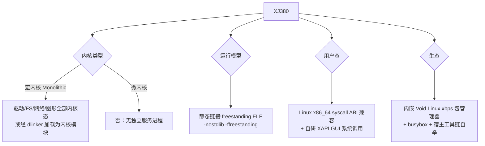
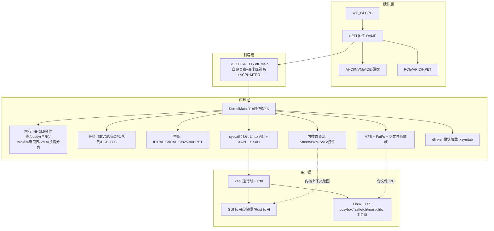
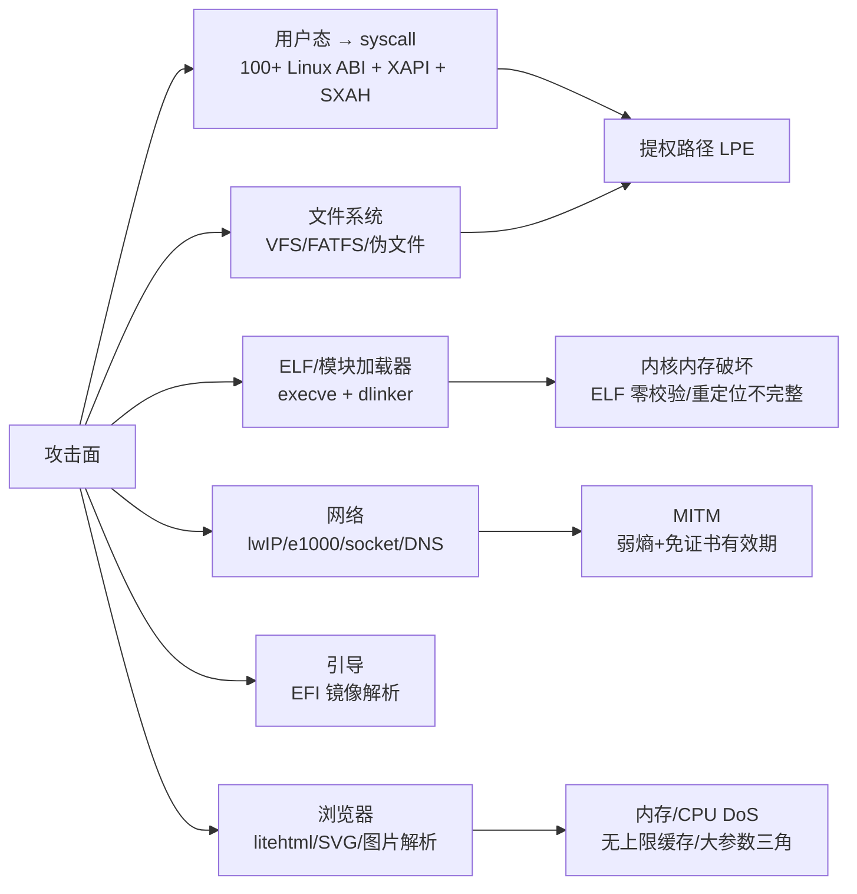

# XJ380 (Code Singularity) 操作系统 —— 完整软件尽职调查与代码考古报告

> **报告日期**：2026-07-31
> **分析对象**：`C:\Users\33155\Documents\AIGC\miao_xj380\XJ380`（本地检出，当前分支 `XSK2.1`，HEAD `08e49b98` "feat: 拖动桌面图标及布局保存"）
> **分析方法**：graphify 知识图谱（29952 节点/85860 边/902 社区）+ 全目录遍历 + 逐文件阅读（6 路并行子代理）+ Git 历史考古 + 源码血统比对 + 静态度量 + **QEMU 实证启动**
> **参考**：以 `xhdndmm/xj380os-full-report` 为参考起点，但**所有关键论断均经本地独立核查**，仅作参考，不照抄。

---

## 0. 报告说明与证据体系

### 0.1 证据分级体系

本报告每项结论标注证据来源，分级如下：

| 记号 | 含义 |
|---|---|
| `[代码]` | 已直接阅读源码验证（含行号） |
| `[实测]` | 本次审计在本机实证运行获得（构建/镜像/启动/截屏） |
| `[git]` | Git 历史/提交/分支证据 |
| `[CI]` | CI 配置文件证据 |
| `[外部]` | 第三方独立事实（如 fastfetch 官方仓库） |
| `[自称]` | 项目自身声明，未经独立证实 → **一律不作为结论** |

**声明核查总则**：README 自称"A 级机密"、版权头"2017-2026"等宣传性声明，必须通过代码、提交、许可证、公开仓库比对验证；无证据支持的声明均标注 **未证实/疑似**。（注："被 fastfetch 收录"经 PR #2309 证实为真，见 §10.3/§11.6。）

### 0.2 本次实证结果（本机完成，非转述）

| 实证项 | 结果 | 详情 |
|---|---|---|
| 全量构建 | ✅ 成功 | Ubuntu 24.04 + clang 18.1.3 + rustc 1.97，`gen_ninja.py` 生成 551 条规则，`ninja all` **524/524 目标 0 错误**（含 kernel.krl 5.3MB、browser.elf 36MB、33 个用户应用、xhci.sys、netserver.sys、litehtml、StardustUI 示例） |
| 镜像管线 | ✅ 成功 | `ninja vdisk` → XJ380.img 3.2GB（GPT + FAT32，sgdisk/mkfs.vfat/mcopy） |
| **QEMU 实机启动** | ✅ **成功** | 官方 QEMU 参数 + OVMF.fd + KVM，完整串口日志 452 行 |
| 网络栈 | ✅ **可用** | e1000 → netserver → lwIP，**DHCP 获得 10.0.2.15 租约**，DNS 223.5.5.5，ARP 正常 |
| GUI 启动 | ✅ 成功 | Sheet 管理器 → XWM 窗口管理器 → TTF 字体（XJ380F/C.ttf 10.8MB/5.4MB）→ 桌面 → **login 用户进程（pid=1）创建** |
| GUI 渲染 | ✅ 有真实画面 | QEMU screendump 捕获 1280×768 帧缓冲，像素分析：82 种颜色桶、含 XJ380 品牌蓝 #00a2e8 与白色 UI、中心行 56 种颜色 → 登录界面真实渲染（用户可自行查看 `C:\Users\33155\AppData\Local\Temp\opencode\xj380-screen.png`） |
| 内核稳定性 | ✅ 观察窗口内无 panic | 启动全程无页错误/异常/WSOD 触发（实测日志 452 行） |
| xhci USB | ⚠️ 部分 | QEMU 的 usb-kbd/mouse（USB1.1 设备）probe 失败 rc=-19（ENODEV），不影响启动 |

> **结论预告**：本项目 **可编译、可打包、可在 QEMU 下真实启动至 GUI 登录界面、网络栈可用**。这已远超"玩具/Demo"，是本报告成熟度评估的基石性证据。

---

## 1. 项目识别

### 1.1 项目身份

| 属性 | 值 |
|---|---|
| **项目名称** | XJ380（内部代号 "Code Singularity"） |
| **所属组织** | XINGJI（星集）Interactive Software 工作室 |
| **保密声明** | README 自称 "A 级机密 \| 保密编号 XSEC202212011-11-A"（`[自称]` **未证实**：仓库本身公开在 GitHub，无任何实际保密机制） |
| **代码托管** | GitHub `xingji-studio/XJ380`（历史上有 60+ 分支） |
| **项目类型** | freestanding x86_64 宏内核操作系统（UEFI 引导 + 单体内核 + 用户态 ELF + 可加载 `.sys`/`.km` 模块） |
| **编程语言** | C(C11)、C++(内核 GNU++17 / 用户态 C++11)、汇编(NASM + clang .S)、Rust(5 个 no_std 用户应用)、Python(构建系统)、Shell(镜像管线) |
| **构建系统** | **自研 Python Ninja 生成器** `tools/gen_ninja.py`（无 Makefile/CMake，Makefile 已于 2026-06 淘汰） |
| **第一方代码量** | 约 38.9 万行（含空行；去 vendored 后约 31 万行） |
| **全项目代码量** | 约 143 万行（含 third_party 104.5 万行） |
| **开发时间线** | 2023-07-15 至今（约 3 年）；版权头"2017-2026"为夸大声明 `[git]` `[自称]` |
| **核心开发者** | Guoqiyu1115（郭启宇，全仓 677+ 提交，kernel 501 提交）、luxizhneg（kmod/网络 20 提交）、lihanrui2913（boot/内核 60 提交）、Leonmmcoset（构建/工具 14 提交）等 30+ 作者 |

### 1.2 操作系统类型判定



**判定：自研宏内核（Monolithic Kernel），类 Linux 架构 + 图形置于内核态的混合设计。**

### 1.3 判定证据链

1. **高半区内核布局** `[代码]`：`linker.ld` `ENTRY(KernelMain)`、内核加载于 `0xFFFFFFFF80000000`；bootloader 用 `PML4[256]` 别名制造 `phys + 0xffff800000000000` 直接映射（bootx64.c CreateAndMapNewPageTable）；`kernel/memory/hhdm.cpp` 提供 `phys_to_virt/virt_to_phys`。
2. **内核/用户隔离** `[代码]`：RING0/RING3（SELECTOR_USER_CS/DS），`syscall`/`sysret`（MSR STAR/LSTAR/SYSCALL_MASK，`init_syscall`），用户态独立页目录（每进程 `pagedir`），copy_from/to_user 辅助（`include/mm/uaccess.h`）。
3. **Linux ABI 外壳** `[代码]`：syscall 号照搬 Linux x86_64（SYS_READ=0 … SYS_FACCESSAT2=439，user/xapi/include/libsys.h）；`-4095` errno 约定（`posix_ret.cpp __xposix_ret`，musl `__syscall_ret` 惯用法）；procfs 伪造 `"Linux version 6.6.30"`。
4. **宏内核特征** `[代码]`：driver(AHCI/NVMe/IDE/PCI/HDA/PS2) 全部链接进 kernel.elf；可加载模块 `.sys`（e1000/netserver/xhci）经 dlinker.cpp 加载，仿 Linux `EXPORT_SYMBOL/.ksymtab`。
5. **与 Linux 最大区别** `[代码]`：图形/窗口系统（graphics/ 图层合成 + XWM 窗口管理器）运行在**内核上下文**，用户程序通过 `xapi_*` 系统调用访问。

### 1.4 不是的类型

- **不是 Linux/BSD 发行版或魔改**：内核源码为原创实现（无任何 Linux/BSD 内核文件入树），但**用户态大量寄生 Linux 生态**（busybox/musl/glibc/xbps/工具链）。
- **不是微内核**：驱动直接在内核态。
- **不是 Unikernel/LibOS**：有完整用户态/进程隔离与 syscall 边界。

### 1.5 设计来源谱系（详见第 5 部分）

| 来源 | 影响面 | 证据 |
|---|---|---|
| 于渊《自己动手写操作系统》(Orange'S OS) | 项目起点（2023 年树布局 boot/drivers/gui/include/kernel/lib 与其同构；后续重写为 64 位） | `[git]` 2023-08-01 树结构 + 早期 commit |
| 《30天自制操作系统》(Haribote) | **概念/命名影响**（图层系统 sheet_num"图层数量-1"、lift_sheet、刷新/置顶机制）+ `cp537.cpp` 直接移植（`s/v/_/e` 位宏）；**hankaku 字库/鼠标光标逐字节比对 ≠ Haribote（字库实为 MikanOS 同款，见 §5.4）** | `[代码]` sheet.cpp/cp537.cpp |
| MikanOS《ゼロからのOS自作入門》 | **FrameBufferConfig 结构逐字段一致 + `CalcLoadAddressRange`/`CopyLoadSegments` 函数同名同逻辑（已源码比对证实）**、`KernelMain(const FrameBufferConfig&)` 启动约定、**hankaku 8×16 字库逐字节一致（0% 差异）** | `[代码]` boot/elf.h、efi/fbc.h、font/hankaku.bin（见 §5.4） |
| OSDev Wiki | 串口/PCI/AHCI/NVMe/APIC/SMP 教程结构 | `[代码]` bootlib.c、pci/ahci/nvme/smp |
| Linux | EEVDF 调度、VMA、zones、capget/setuid、procfs、EXPORT_SYMBOL、信号 | `[代码]` scheduler.cpp/vma.cpp/buddy.cpp/sys.cpp |
| Plan 9 / suckless libutf | utflib.cpp（chartorune/utftab，保留 "See LICENSE file" 版权头） | `[代码]` kernel/utflib.cpp |
| musl | ABI 惯用法 `__xposix_ret`(-4095 约定) | `[代码]` posix_ret.cpp |
| glibc | elf.h（原版 vendored）、__ctype_b_loc 等符号 | `[代码]` include/elf.h/ctype.cpp |
| Windows | 窗口消息体系 MSG_*/WndProc 回调 | `[代码]` graphics/window/windowm.cpp |
| 第三方 vendored | lwIP 2.2.1、FatFs R0.15、mbedtls 3.6.5、litehtml、lexbor、libvterm、libwebp 1.6.0、nanosvg、stb 三件套、dr_mp3 | `[代码]` 详见附录 A |

### 1.6 运行时环境与启动流程

```
UEFI 固件 (OVMF.fd) ──> boot/bootx64.c efi_main ──> 自建页表 + 高半区别名
   ──> ExitBootServices ──> kernel/main.cpp KernelMain ──> desktop_flusher 线程 → 登录 → 桌面
```

`[实测]` 本次 QEMU 启动完整走通上述链路（见 0.2）。
---

## 2. 目录分析

### 2.1 目录总览（第一方代码量，含/不含空白行）

| 目录 | 文件数 | 总行数 | 非空行 | 职责 | 首次出现 `[git]` |
|---|---|---|---|---|---|
| `boot/` | 10 | 2,373 | 2,059 | UEFI 引导器（efi_main、自建页表、ACPI、引导菜单） | 2023-07-16 |
| `kernel/` | 58 | 25,713 | 22,416 | 内核核心（KernelMain、内存、任务、中断、syscall、dlinker） | 2023-07-16 |
| `driver/` | 38 | 43,888 | 41,011 | 内置驱动（FS/VFS、AHCI/NVMe/IDE/PCI、HDA、PS2、RTC、串口） | 2024-12-08 |
| `graphics/` | 16 | 18,873 | 16,584 | 图层合成/窗口管理/SVG/Toast/控件（内核态 GUI） | 2023-07-16 |
| `font/` | 4 | 6,881 | 6,129 | 点阵 + TTF 渲染（stb_truetype 封装 + 安全校验层） | 2024-08-09 |
| `include/` | 111 | 19,281 | 16,725 | 内核/模块/用户三方 ABI 头 | 2023-07-16 |
| `lib/` | 3 | 174 | 164 | 小型支持库 | 2023-07-16 |
| `kmod/` | 267 | 116,429 | 104,792 | 可加载模块（netserver/lwIP、xhci、e1000；含 vendored lwIP ~8 万行） | 2026-03-18 |
| `user/` | 346 | 116,998 | 104,077 | 用户态应用 + xapi 运行时 + 浏览器 | 2025-02-05 |
| `tools/` | 13 | 3,335 | 2,939 | 构建/镜像管线（gen_ninja.py、ninja_build.py、stage_*.sh） | 2024-08-04 |
| `frameworks/` | 178 | 34,859 | 29,903 | StardustUI（git 子模块，跨平台 UI 框架 + XJ380 平台适配） | 2026-05-02 |
| `third_party/` | 1,175 | 1,044,982 | 978,324 | vendored 上游（litehtml/lexbor/libvterm/mbedtls/busybox-prebuilt） | 2026-04-04 |
| `Bf/` | 31 | 0 | 0 | Void Linux xbps 打包资源（含检入的 xbps-static 二进制 15MB） | 2026-05-10 |
| `resources/` | 20 | 0 | 0 | 镜像素材（busybox/fastfetch 预编译、musl .so、壁纸、SVG 图标） | 2026-04-06 |
| `tests/` | 2 | 105 | 79 | 构建生成器测试（1 真 1 死） | 2026-06-07 |
| 根目录杂项 | ~15 | 6.3 万行生成物 | — | build.ninja、linker.ld、OVMF.fd、seabios.bin、*.elf、test.wav、test.txt、layout 等 | — |

**第一方合计（除 third_party）：约 38.9 万行（含空白）/ 34.7 万行（非空）；再剔除 kmod/netserver/lwip 上游后约 31 万行。** 与外部参考报告"第一方约 30 万行"量级一致。

### 2.2 逐目录评估

#### `boot/` —— UEFI 引导层（全项目最脆弱架构耦合点）

- `efi_main`（bootx64.c 1258 行）：协议获取 → 300ms 引导菜单 → 自建页表 → 读内核 ELF → 内存映射 → ACPI(MADT/FADT/HPET/MCFG) → MTRR 保存 → 256 个 AP 临时栈 → ExitBootServices → 跳转 KernelMain。
- **`[代码]` 高危问题**：
  1. **ELF 加载零校验**（boot/include/elf.h）：不验魔数/phoff/phnum/p_offset/p_memsz 边界，`p_memsz<p_filesz` 会下溢巨量 memset——依赖"镜像自产"才未触发。
  2. **`config` 结构跨栈切换访问**（bootx64.c）：切栈前赋值、切栈后取址，行为依赖编译器把 `&config` 缓存进寄存器 + PML4[0]/PML4[256] 共享 PDPT 的巧合——**UB 驱动，随时可能炸**。
  3. **`Hex2Char/Dec2Char` 返回悬垂栈指针**（bootlib.c L189/L225）。
  4. `mallocAt()` 忽略调用者指定地址（`AllocateAnyPages` 而非 `AllocateAddress`）。
  5. efi.h 用手工 `_bufN` 占位跳字段抄 EFI 结构——字段错位即函数指针错乱，无编译期校验；`EFI_RUNTIME_SERVICES_REVISION` 引用未定义宏。
  6. 指针语义双轨制：`+0xffff800000000000` 的虚拟指针（BootConfig/temp_stack/new_stack/config）与裸物理指针（saved_mtrrs、installer pak）混用。
- 血统：MikanOS 框架 + Haribote 菜单风格 + 自研引导菜单/installer 分支 `[代码]`。

#### `kernel/` —— 内核核心（结构现代、细节两极化）

- `KernelMain`（main.cpp 975 行）：CPU→IDT/GDT→HPET/APIC→HHDM→帧分配→堆→设备→VFS→FATFS→PCI→AHCI/NVMe/IDE→分区→HDA/键盘/鼠标→进程→SMP→idle 线程→rootfs→伪文件系统→syscall→模块加载→reaper→桌面线程。全程带串口进度日志（`BOOT: xxx begin/done`）`[实测]` 本报告实证启动即见这些日志。
- 内存管理：HHDM 直接映射 + bitmap 帧分配（buddy 已实现但 `ENABLE_BUDDY 0` 禁用）+ Rust talc 堆（--wrap 自动扩容至 2GB）+ 4 级页表 + Linux 式 VMA + 按需分页。
- 任务：EEVDF 调度器（但权重被约掉，见 §4.3）、每 CPU 运行队列、IPC/mutex/poll/reaper。
- **`[代码]` 已直接验证的严重问题**：
  - `atom_queue.cpp` 的"无锁"队列**完全不可用**（cas 恒 false / load 用 xadd 自增）——见 §4.9。
  - `wsod.cpp` 的 `do_wsod` 是 `// TODO: WSOD` + `while(1) pause` 死循环；`backtrace.cpp` 的 `lookup_kallsyms` 返回 0 的桩——**内核崩溃无诊断**。
  - `syscall/fs.cpp`(182)、`syscall/proc.cpp`(81) 整文件被注释（Linux 教学代码化石，引用 `current_task->parent_group->fds`、`init_task_union`）。
  - `frame.cpp` 的 `free_frame/free_frames` 整段被注释（连同 EXPORT_SYMBOL）。
  - `memory/buddy.cpp` 的 `free_frames` 顺序 bug：先 `address_unref` 减引用再检查能否释放，失败时不回滚——状态不一致。
- 米姆文化泛滥 `[代码]`：变量名 `zhe_shi_yi_ge_sha_bi_dao_ji_zhi_de_..._GuoqiFish_is_shabi_...`、`#define NULL 0`、"MAKE XJ380 GREAT AGAIN"、`// 这是一个傻逼倒计时的操作`、ASCII 猫咪冰箱。

#### `driver/` —— 内置驱动（职责定位混乱）

- 块设备三层（device_t → bounce → AHCI/IDE/NVMe）→ FatFs → VFS → syscall。
- **`[代码]` 职责混乱点**：
  - `ps2/mouse.cpp`（2025 行）本质是**完整 GUI 输入管理器**（拖拽/贴靠/Dock 菜单/关机），真正 PS/2 协议仅 ~60 行。
  - `serial/serial_port.cpp`（1034 行）内嵌整个 printf 库 + 屏显调试 overlay（依赖 graphics/font）。
  - `fs/vfs/vfs.cpp` 里混入 tty/stdio/null/urandom 设备。
  - `fs/vfs/sys.cpp`（204 行）整文件被注释；`fs/fs_syscall.cpp` 0 字节空文件。
  - `vsound.cpp` 内联整个 dr_mp3（4257 行头）进内核映像。
  - 存储三套并存（AHCI/NVMe/IDE）无统一 blkdev 抽象。
- 权限模型：`vfs_node` 有 owner/group/mode 字段，但 open/read/write 路径**完全不检查**（见 §8）`[代码]`。

#### `graphics/` + `font/` —— 内核态 GUI（原创度最高）

- 图层合成器（sheet.cpp 1147 行）：链表式新设计 + 脏矩形队列/双缓冲；受 Haribote 图层**概念**影响（sheet_num/lift_sheet 命名），非代码复制（见 §5.4）。
- 窗口管理器（windowm.cpp 1392 行）：Windows 消息模型，Alt+Tab/最大化/显示桌面。
- **svg.cpp（2473 行）自研 SVG 光栅化器**：贝塞尔展平/非零环绕/超采样抗锯齿/路径穿越防护——全项目原创度最高的文件之一。
- font：自备 8×16 hankaku 点阵（**与 MikanOS 字库逐字节一致 0%，非 Haribote 同款**——经官方 makefont.exe 验证，见 §5.4）+ stb_truetype v1.26 原版 + **自研 ttf_validate_font_data 校验层**（缓解 stb_ttf 无安全保证，值得肯定）；TTF 每次调用分配 2560×1440×1 ≈ 3.7MB 位图（性能问题）。
- 全局无锁状态泛滥：`sht_img/xwmii/ms_dec/first_button/...`。

#### `user/` —— 用户态（质量梯队落差最大）

- xapi 运行时：crt0.S(9 行跳板) + start/constart + Linux syscall 直通层 + 自研 malloc（带 magic）+ musl 式 libc 重写。
- 20 个应用：shell、desktop、dock、launcher(Rust)、login、ctrlmenu、taskmgr、texter、calc(Rust)、fmanager、filedlg、picturer、elfrun、nut、installer、xjver(Rust)、busyterm(Rust)、browser、chat、测试集。
- 质量梯队（详见 §3）：精致层（texter/desktop/installer/cm_settings）→ 中等（launcher/login/calc）→ 粗糙层（shell 溢出、fmanager 未初始化、ctrlmenu 越界、math.h 全错、bcms-sp 114KB 栈数组）。

#### `kmod/` —— 可加载模块

- netserver（lwIP 2.2.1 原版 + 移植层）、xhci（3180 行工程化最好）、e1000（教学级）、dlinker_test（未入构建）。
- lwIP 本地修改违反"avoid local edits"约定：`dhcp.c` 注入 8 处 printk、`etharp.c` 改 hwaddr_len `[代码]`（实测启动日志可见 `dhcp_recv:` 打印）。
- 详见 §3.6。

#### `tools/` + `Bf/` + `resources/` —— 构建与镜像

- `gen_ninja.py`（1342 行）：工程上最成熟的单文件——确定性输出、write_if_changed、`--fail-if-changed` 预检、vendored 显式白名单、测试（test_gen_ninja.py）。但硬编码 `/home/leon/.rustup/...`、强依赖 rust target。
- 镜像管线：`stage_*.sh` 把宿主 glibc/gcc/clang/busybox/fastfetch/musl/xbps-static 全量拷入镜像——**供应链面大且无校验和/签名验证，备用仓库为明文 HTTP**。
- `ninja_build.py` `qemu_cmd`：官方启动参数（`[实测]` 本次 QEMU 启动即按此复刻）。

#### `frameworks/StardustUI/` —— 独立 git 子模块

- `xingji-studio/StardustUI`（MIT），跨平台 UI 框架，XJ380 平台适配（platforms/xj380.cpp 1235 行）通过 xapi syscall 包装实现；HTTPS 明确未实现。`[实测]` 确认参与构建（out/helloworld.elf、layout.elf、duckchat.elf）。

#### 根目录杂项 —— 仓库卫生问题

- 检入产物：`test.wav`(22.6MB)、`doom.elf`/`xjdoom.elf`、`layout`(孤儿 ELF)、`1.c`、`test.txt`(114514/1919810)、`serial1.log`(0B)、`gcc_13.3.0-r7_x86_64.ipk`(2026-05 检入后又删除)。
- `OVMF.fd`/`seabios.bin`/`startup.nsh`/`liballoc-x86_64.a`(预编译供应链) 检入。

### 2.3 目录结构评价

**合理之处**：kernel/driver/kmod 边界约定清晰（AGENTS.md 明确"内核进 kernel/、内置驱动进 driver/、可加载模块进 kmod/"）；include/ 作为共享 ABI 层；构建生成器白名单化 vendored 代码。

**不合理之处**：
1. `driver/` 混入窗口管理器与 printf 库（mouse.cpp/serial_port.cpp）。
2. `include/proto.hpp` 是巨型"垃圾桶"头（263 行拖入整个图形栈 + mm + ps2），造成全局编译耦合。
3. `fs.cpp/proc.cpp/sys.cpp` 整文件注释（历史遗留）与 sys.cpp 5340 行巨兽并存。
4. 根目录散落测试残留（test.wav/1.c/test.txt/layout）。
5. `include/fs/vfs/list.h` 用 `#undef extern` 在头文件里放实现——重复符号风险。
6. 头文件复制粘贴：`stdarg.h/strings.h` 在 frameworks/StardustUI 与 user/xapi 出现三份全同副本 `[度量]`。

---

## 3. 逐文件分析

> 第一方全部源码文件经 6 路并行子代理逐文件过读 + 本审计对核心文件人工精读。此处按模块给出**每文件的职责与关键问题**；标注 🔴=高危/确证缺陷，🟠=中危/设计问题，🟡=低危/风格。行数为实测（含空行）。

### 3.1 boot/ 逐文件

| 文件 | 行数 | 职责 | 关键问题 |
|---|---|---|---|
| `bootx64.c` | 1258 | UEFI 主引导器（协议→菜单→页表→ELF→ACPI→MTRR→ExitBootServices） | 🔴 跨栈访问 `config`(UB)；`mallocAt` 忽略地址；ACPI 无校验和；🟠 版本字符串为占位符 |
| `bootlib.c` | 268 | 端口/串口/字符串 | 🔴 `Hex2Char/Dec2Char` 返回悬垂栈指针；`part_strcmp` 32B 缓冲可溢出；`insl/outsl` 用 `repne`(应为 `rep`) |
| `include/efi.h` | 531 | 手写 EFI 规范 | 🔴 `_bufN` 占位跳字段无编译期校验；`EFI_RUNTIME_SERVICES_REVISION` 引用未定义宏 |
| `include/elf.h` | 65 | ELF64 加载 | 🔴 零校验（魔数/段边界/p_memsz≥p_filesz 全不查） |
| `include/acpi.h` | 56 | ACPI 表 | 🟡 无校验和；孤儿结构 ACPISDTHeader |
| `include/boot.h` | 41 | BOOT_CONFIG | 🟡 注释自嘲"SMP 用的，懒得写内存管理" |
| `include/memory.h`/`fbc.h`/`msr.h`/`bootlib.h` | 45/23/17/69 | 内存/帧缓冲/MSR | 🟡 msr.h 无 volatile；fbc.h 与 MikanOS 字节级兼容 |

### 3.2 kernel/ 逐文件（核心）

**启动与配置**

| 文件 | 行数 | 职责 | 关键问题 |
|---|---|---|---|
| `main.cpp` | 975 | KernelMain 启动序列 + 桌面线程 | 🔴 全同步初始化、`#define NULL 0`；🟠 100+ busybox 别名暴力枚举；`#if 1==2` 关调试；米姆注释 |
| `build_settings.h` | 156 | 版本/配置 | 版本 "XJ380 Singularity 1.0.0"、XSK 2.1.0、版权 2017-2026(夸大)；ASCII 猫咪 |
| `installer_mode.cpp` | 167 | 安装器启动模式 | 🟠 PAK 路径无 `..` 净化；物理地址无校验 |
| `stress.cpp` | 52 | 2000 进程压测函数 | 🟡 死代码（main.cpp 中注释调用） |

**内存管理**

| 文件 | 行数 | 职责 | 关键问题 |
|---|---|---|---|
| `memory/hhdm.cpp` | 84 | 直接映射 | 🟠 `DRIVER_AREA_MEM 0xffffb0...` 第二套偏移体系；`page_virt_to_phys` 无锁无范围校验 |
| `memory/frame.cpp` | 241 | 帧位图分配 | 🔴 `free_frame/free_frames` 整段注释（含 EXPORT_SYMBOL）——帧释放路径不完整 |
| `memory/buddy.cpp` | 420 | zone buddy | 🟠 `free_frames` 顺序 bug（先减引用后检查，失败不回滚）；`alloc_frames_dma32` 复制粘贴；EXPORT 任意模块可分配任意物理帧 |
| `memory/page.cpp` | 872 | 页表/页错误 | 按需分页+用户栈增长正确；🟠 大量调试转储、`goto err` |
| `memory/heap.cpp` | 60 | --wrap 堆扩容 | 🟠 存在两份 calloc 定义（wrap 与普通），符号冲突隐患 |
| `memory/bitmap.cpp` | 141 | 位图 | 🟠 `bitmap_find_range_from` 忽略 start_from 字节内位偏移（逻辑 bug） |
| `memory/vma.cpp` | 339 | Linux 式 VMA | 结构清晰，`vma_unmap_range` 完整（质量好） |
| `memory/lazyalloc.cpp` | 261 | 按需分页 | 正确拆分/合并虚拟区间（质量好） |

**任务/调度**

| 文件 | 行数 | 职责 | 关键问题 |
|---|---|---|---|
| `task/scheduler.cpp` | 586 | EEVDF 调度器 | 🔴 `vruntime_delta=(runtime*weight)/weight` 权重被约掉，EEVDF 退化（见 §4.3）；`scheduler_sleep_ns` yield 忙等；`select_next_task` O(n) 全队列扫描 |
| `task/pcb.cpp` | 2453 | 进程/线程生命周期 | `kill_proc` 复杂；与 sys.cpp 有复制粘贴（append_cmdline_*）；🚩 需重点回归 |
| `task/ipc.cpp` | 51 | 进程消息队列 | 🔴 `ipc_free_type` 循环内 size 变化致不完全释放；`ipc_recv_wait` 1ms 轮询忙等 |
| `task/mutex.cpp` | 189 | 互斥锁 | 🟠 忙等 yield 无优先级继承/无阻塞（优先级反转）；wait_queue 字段死数据 |
| `task/poll.cpp` | 52 | poll/epoll | 🟠 `select_add` realloc 失败未检查；无边界 |
| `task/reaper.cpp` | 66 | 进程收割 | 🟡 GBK 乱码注释；锁内遍历 |

**中断/CPU/SMP**

| 文件 | 行数 | 职责 | 关键问题 |
|---|---|---|---|
| `intr/handler.S` | 374 | 中断/syscall 汇编入口 | 🔴 异常入口不做 swapgs（用户态异常时 per-CPU 访问读错 GS）；syscall 返回从预留槽读 RIP/RFLAGS（内容依赖 C 处理函数是否写入）；stub 大量复制粘贴 |
| `intr/apic.cpp` | 239 | APIC/IOAPIC | 🟠 MADT 边界判断粗糙；`init_apic` 无 APIC 时静默 `while(1)`；ioapic_disable/mask_all 死代码 |
| `intr/hpet.cpp` | 57 | HPET/nanoTime | 🟠 整数除法 period 可能为 0；`nsleep` 死代码 |
| `intr/8259a.cpp` | 38 | 8259A | 标准 ICW 序列 |
| `smp/smp.cpp` | 445 | AP 启动 | 🔴 MADT x2APIC 分支 `continue` 跳过循环尾部 → 死循环；enabled^online 判定逻辑反转（部分核被跳过）；`scheduler_is_ready` 无内存屏障 spin；idle 用当前 AP 栈做内核栈 |
| `smp/smp_trapo.S` | 163 | AP 跳板 | 🟠 依赖物理低地址恒等映射；`tr` 槽从未写入 |
| `pctable/idt.cpp` | 84 | IDT | int3/overflow 对 RING3 开放（正确）；`save_registers` 签名与实现不匹配 |
| `pctable/gdt.cpp` | 58 | GDT/TSS | 教材式 `lgdt`+`call *%rax`；BSP/AP 两套逻辑复制粘贴 |
| `cpu/*` | — | CPU 支持 | `mtrr_restore` 死代码且解引用 NULL 不返回；`insw/insl` 风格不统一；fpu.cpp 无 AVX 状态处理 |
| `wsod/wsod.cpp` | 138 | 内核 panic | 🔴 `// TODO: WSOD` + `while(1) pause` 死循环——崩溃无任何诊断 |
| `wsod/backtrace.cpp` | 41 | 栈回溯 | 🔴 `lookup_kallsyms` 返回 0 的桩；解引用 rbp 前无有效性检查 |

**系统调用**

| 文件 | 行数 | 职责 | 关键问题 |
|---|---|---|---|
| `syscall/sys.cpp` | 5340 | 全部 Linux ABI 系统调用 | 🔴 chmod/chown 无权限检查、open/read/write 不检查 mode/owner（见 §8）；大量 `[busybox-debug]` 残留；巨兽文件 |
| `syscall/syscall.cpp` | 806 | syscall 分发/init_syscall | 覆盖 100+ 系统调用；`debug_syscall_name` 表 |
| `syscall/signal.cpp` | 303 | 信号 | 🔴 SIG_DFL 终止路径 `kill_proc` 后 `while(1) hlt`（烧核）；STOP/CONT 无完整实现；`signal_deliver_pending` 页边界 -EFAULT 重试可能死循环 |
| `syscall/message.cpp` | 250 | 窗口消息管道 | 🔴 把内核函数 `message_thread` 二进制拷到用户固定地址 `0x11717450000+0x927`（PTE_USER|WRITEABLE）——非常规注入式设计，可被改写；依赖函数在 .text 相邻布局（脆弱） |
| `syscall/fs.cpp` | 182 | 旧文件系统调用 | 🔴 100% 被注释（Linux 教学化石） |
| `syscall/proc.cpp` | 81 | 旧进程调用 | 🔴 100% 被注释（`init_task_union` 引用） |
| `syscall/xapi/xgui.cpp` | 1168 | XAPI 窗口/绘图 | 🔴 `do_xapi_DrawTextl` 坐标 bug（`place & 0xffffffff00000000` 赋给 uint32 恒为 0）；`do_xapi_SetIcon` 直接解引用用户指针（未 copy_from_user）；`xapi_get_window_handle` 先解引用再校验；`CloseWindow` 泄漏 WindowHandle；2026-07-10 修复内核指针直写用户内存漏洞 |
| `syscall/xapi/xtui.cpp` | 753 | 终端/用户管理 | 🔴 密码明文；`do_xapi_KillProcess` 无权限检查；`do_xapi_Input` 忙等无超时；GetTaskList 嵌套锁序风险 |
| `syscall/xapi/xfile.cpp` | 382 | XAPI 文件 | 🟠 `length>(size_t)-1` 恒假防御；`CloseFile` 由用户伪造 length 写任意偏移（无权限模型） |
| `syscall/xapi/xinstaller.cpp` | 1693 | 内核内安装器 | 🔴 全局 `g_installer_progress` 无锁撕裂；硬编码跳过清单含 `/apps/1.c`；`installer_dir_cache` 满即静默丢记录；AI 模板化痕迹明显 |

**用户辅助/其他**

| 文件 | 行数 | 职责 | 关键问题 |
|---|---|---|---|
| `user/user.cpp` | 1589 | 用户/OOBE/登录 | 🔴 OOBE/登录 GUI 直接跑在内核态（职责严重混淆）；密码明文存 usereg.dat 并明文 strcmp；`linux_abi` 无条件覆盖为 true；ELF 加载全段 RWX（W^X 不成立） |
| `user/runfile.cpp` | 226 | 文件关联 | 🔴 `runfile()` 按文件实际 size 读入固定 64KB 栈数组——用户可控文件 → **内核栈溢出** |
| `user/x3tp.cpp` | 92 | 终端协议 | 🟠 `parent_task` 可 NULL 崩溃；无锁缓冲 |
| `user/ulog.cpp` | 50 | 日志 | 🟠 vfs_open 失败 NULL 解引用；追加写无锁 |
| `user/hardware_reg.cpp` | 134 | 硬件信息 | 🟡 vfs_mkfile 返回语义依赖 |
| `krlibc.cpp` | 603 | 内核 libc | strtol 为经典 cutoff/cutlim 算法（BSD/glibc 一脉，见 §5.4）；strcpy/strcat 无界 |
| `utflib.cpp` | 144 | **Plan 9/suckless libutf 逐字移植** | 保留 "See LICENSE file" 版权头 |
| `xflib.cpp` | 60 | 遗留工具 | 🔴 `getline_from_file` 无边界写；疑似死代码 |
| `lock_queue.cpp` | 387 | 自旋锁队列 | 🟠 enqueue/queue_enqueue/queue_enqueue_ref 三份复制粘贴；`queue_iterate` 持锁回调可死锁 |
| `atom_queue.cpp` | 133 | "无锁"队列 | 🔴 **完全不可用**：`cas()` 恒 false（cmpxchg 结果未写回 ret）；`load()` 用 `lock xadd` 自增被读目标（见 §4.9） |
| `id_alloc.cpp` | 57 | ID 分配 | 🟠 `max_ids==0` 时 `(id+1)%0` 除零 |
| `netdev.cpp` | 67 | 网络设备注册 | 🟡 无锁返回 netdevs[0] |
| `dlinker.cpp` | 1299 | 模块/共享对象加载器 | 🔴 新路径 `kmod->task_entry=NULL` 使 **`dlstart` 协议失效**；重定位无段边界校验、IRELATIVE 直执行 resolver、COPY 按 st_size memcpy 不受控；新旧两套实现并存；`EXPORT_SYMBOL(page_virt_to_phys)` 导出未在本地定义的符号 |

### 3.3 driver/ + include/ 逐文件

**文件系统**

| 文件 | 行数 | 职责 | 关键问题 |
|---|---|---|---|
| `fs/fatfs/ff.cpp`/`ffunicode.cpp` | 7649/17767 | **ChaN FatFs R0.15 w/patch3 原版** | 仅加自写 strchr 补丁；ffunicode 为 GBK 表生成文件 |
| `fs/fatfs/fatfs.cpp` | 677 | FatFs 适配层 | 🔴 `fatfs_dup` 共享 FIL/DIR handle → **double-close/UAF**；全卷单全局锁；statfs 假数据 |
| `fs/fatfs/diskio.cpp` | 203 | FatFs 磁盘粘合 | 🟠 预读缓存 512KB/盘永不释放（重挂载泄漏）；>2TB 盘 `disk_size` 截断 |
| `fs/fatfs/ffsystem.cpp` | 85 | OS 依赖层 | 🟡 `ff_mutex_take` 无 return（但 FF_FS_REENTRANT=0 已条件编译掉） |
| `fs/vfs/vfs.cpp` | 1277 | VFS 核心 + tty/urandom | 🔴 权限零检查；`vfs_get_fullpath` 256B 缓冲 strcat；符号链接无深度限制；`general_map` 直接把文件数据写到用户地址（无 SMAP/copy 处理）；urandom 用 xorshift(时间) 弱 PRNG；`vfs_regist` 要求 19 回调全非空；tty_ioctl 直接 memcpy 用户指针 |
| `fs/vfs/dev.cpp` | 326 | devfs | 🔴 `extern device_t device_ctl[26]` 与定义 `[256]` 数组边界不一致（ODR 隐患）；全局 RD_lk/WR_lk 串行化所有设备 I/O；`devfs_mkdir` 设 `fsid=0`；`/dev/ptx` 拼写怪点 |
| `fs/vfs/sys.cpp` | 204 | sysfs | 🔴 100% 被注释（死代码），sys.h 留孤儿声明 |
| `fs/vfs/tmpfs.cpp` | 353 | tmpfs | 🟠 `tmpfs_dup` 不增引用计数（悬垂风险）；全局限流锁；`tmpfs_rename` 不动父链 |
| `fs/vfs/pipefs.cpp` | 289 | pipefs | 🔴 `pipefs_close` 释放 other_spec 后另一端 handle 仍指向它（**UAF**）；管道满无超时无限阻塞；`pipe_wait_on` 忙等 |
| `fs/vfs/pty.cpp` | 767 | PTY | 🟠 全部 read/write 轮询忙等；`ptmx_open` 同名 pts 泄漏；ioctl 直接 memcpy 用户指针；锁序接近 ABBA |
| `fs/vfs/socketfs.cpp` | 609 | socket VFS 壳 | 🟠 全局单 provider（快照含函数指针，模块卸载即悬垂）；大量 printk 噪音 |
| `fs/vfs/unixsock.cpp` | 657 | AF_UNIX | 🔴 `unix_accept` 忙等无超时；stream 写持锁自旋；对端互联可 ABBA 死锁 |
| `fs/vfs/dnsfs.cpp` | 423 | DNS 伪文件系统 | 🟠 全局静态 handle 跨进程共享；`dnsfs_write` 直接 memcpy 用户指针 |
| `fs/vfs/nmfs.cpp` | 639 | NetworkManager 伪文件 | 🟠 同 dnsfs；768B 栈缓冲 sprintf |
| `fs/partition.cpp` | 676 | MBR/GPT | 🔴 GPT **无 CRC 校验**、无 backup GPT 回退；`num_partition_entries*size` 无上限可大分配；`mount_root` 找不到系统 `while(1)` 挂死 |

**存储/PCI/音频**

| 文件 | 行数 | 职责 | 关键问题 |
|---|---|---|---|
| `ahci/ahci.cpp` | 530 | SATA | 🟠 持全局锁同步等待命令；`port->cmdlst` 把物理地址当指针存；op_buffer 4MB 分配后从未使用；cmd 表映射建在当前进程页表 |
| `ahci/ata.cpp` | 147 | ATA DMA | 🟠 读命令后固定 50us 延时（凭经验）；TRACE 注释 |
| `ahci/atapi.cpp` | 82 | ATAPI | 🟠 byte count 左移 8 塞进 LBA 字段（>16MB 截断） |
| `ahci/utils.cpp` | 130 | 命令发送 | 🟠 `ahci_post` 异步字段无调用方（死结构） |
| `nvme/driver.cpp` | 556 | NVMe | 🔴 `NVMEWaitingCMD/RDY` **无超时死等**（设备故障即挂死）；相位翻转判断错误；只探测 nsid=1；无 MSI |
| `nvme/nvme.cpp` | 30 | NVMe 壳 | 空实现 remove/shutdown |
| `ide/ide.cpp` | 367 | IDE PIO | 🔴 未知 ioctl 返回成功；LBA28 限制；无 DMA |
| `pci/pci.cpp` | 653 | PCI(e) | 🔴 MMIO 路径 `mmio_address==0` 时继续解引用 0 地址（空指针崩溃）；64 位 BAR 无 i>=5 检查（可改写 Expansion ROM 寄存器）；`EXPORT_SYMBOL(malloc/free)` |
| `hda/hda.cpp` | 751 | 声卡 | 🟠 RIRB 索引 `*2` 应为 `*4`（但 DMA 分支是死代码，实际走 mmio）；多次 250ms 延时；`wbinvd` 全缓存刷写；IRQ 日志风暴 |
| `hda/vsound.cpp` | 1066 | 音频抽象 | 🟠 内嵌 dr_mp3 4257 行进内核；读忙等；`vsound_clearbuffer` 重复入队 |
| `hda/pcspk.cpp` | 76 | PC 喇叭 | 🔴 `tmp != (tmp|3)` 恒假——静默失败的死驱动 |
| `sb16.cpp` | 108 | SB16 | 🔴 `count=size/2-1` 下溢；ISA DMA>16MB 静默失败；无限忙等 IRQ |
| `rtc.cpp` | 182 | CMOS RTC | 🔴 `cmos_read` 先开中断再取锁（窗口被中断打断）；`tm_yday` 恒按闰年算；`clock_hour_offset` 可越界 |

**串口/输入/杂项**

| 文件 | 行数 | 职责 | 关键问题 |
|---|---|---|---|
| `serial/serial_port.cpp` | 1034 | 串口 + **printf 全家** | 🔴 `sprintf` 用 UnsafeBufWriter 无边界；`write_serial_string_colored` 持锁逐字符 outb（锁内不自旋保护，IRQ 打印即死锁）；DEBUG overlay 依赖 graphics/font |
| `ps2/mouse.cpp` | 1782 | **GUI 输入管理器** | 🟠 2025 行仅 ~60 行 PS/2 协议，其余是窗口拖拽/贴靠/Dock 菜单状态机；双击用秒级 mktime；大量魔法坐标 |
| `ps2/keyboard.cpp` | 698 | 键盘 | 🔴 IRQ 直接调窗口管理器/消息系统（中断上下文进 GUI）；全局快捷键硬编码；旧 kb_fifo 残留 |
| `fbdev.cpp` | 297 | framebuffer | 🔴 ioctl 直接写用户指针（无 copy_to_user）；fbdev_map 把物理帧暴露为用户映射（含内核数据） |
| `device.cpp` | 538 | 设备注册/bounce | 🟠 `blk_user_buffer_valid` 对内核地址无条件放行；每次 I/O 重新 alloc_frames+映射；`delete_device` trylock 失败泄漏 |
| `dma.cpp` | 122 | 8237 DMA | 🟠 地址按值当物理地址（接口隐患）；≥16MB 无错误反馈 |
| `power.cpp` | 311 | ACPI 电源 | 🟠 手写 `_S5_` AML 字节扫描（脆弱）；`with_efi_identity_map` 临时换页表调 EFI 固件（跨进固件风险）；FADT 无校验 |

**include/ 关键头文件**

| 头文件 | 判定 | 说明 |
|---|---|---|
| `proto.hpp` | 🔴 巨型垃圾桶头 | include 整个图形栈+mm+ps2，声明 sht_img/xwmii 等全局；任何驱动 include 即拖入 GUI |
| `pxapi.h` | ABI | XAPI 系统调用号(380~7470) + **SXAH 隐藏接口**（`128956723895689203`=密码检查等，注释"严禁泄露"）`[代码]` |
| `syscall.h` | ABI | Linux 风格系统调用号 + `XJ380_PRIVATE_MESSAGE_REVERT_ADDRESS 0x11717450000`、`XPSR_OFFEST 0x927` |
| `elf.h` | vendored | **glibc 原版**（LGPL），仅加 #pragma once |
| `dr_mp3.h` | vendored | dr_mp3 v0.6.39（public domain） |
| `dlinker.h` | ABI | EXPORT_SYMBOL/.ksymtab、dlopen/dlsym 克隆 |
| `device.h` | ABI | device_t 虚表 |
| `ioctl.h` | ABI | Linux ioctl 号复制 + 私有号 |
| `errno.h` | ABI | Linux errno 全表 |
| `mm/alloc/alloc.h` | ABI | talc 风格堆接口（Rust 注释 `align_of::<usize>` 铁证） |
| `uaccess.h` | 辅助 | copy_from/to_user 正确工具，但 VFS/driver 层几乎未用 |
| `krlibc.h` | 宏垃圾场 | container_of/unlikely/waitif 等 GNU statement-expr 宏 + `// Fuck you C++` |
| `fs/vfs/list.h` | 🔴 危险 | `#undef extern` + 头内实现（重复符号风险） |
| `ps2/keyboard.h`/`mouse.h` | 循环依赖隐患 | 设备头 include graphics/sheet.h（拖入 GUI） |

### 3.4 graphics/ + font/ 逐文件

| 文件 | 行数 | 职责 | 关键问题 |
|---|---|---|---|
| `sheet.cpp` | 1147 | 图层合成器 | 🟠 `create_sheet` 的 `sheet_num-4` 沿用 Haribote 图层概念的预留 4 层习惯（命名层影响，见 §5.4）；`getBX` 失败返回 0；全局 `allow_to_flush` 无屏障；逐像素软件 alpha 无 SIMD；单一全局脏队列 |
| `window/windowm.cpp` | 1392 | 窗口管理器 | 🟠 `create_window` 分配 `(w+24)*27*4` 写法脆弱；`mpf_found_win` 依赖全局 `xwmii->start`；Alt+Tab 预览 index 与 create_sheet 语义叠加 |
| `desktop.cpp` | 414 | 桌面/Dock | 🟡 `LCD_AlphaBlend` 浮点逐像素（3 处复制）；`memset(front_p->path,0,64)` 与 `path[256]` 不一致 |
| `svg.cpp` | 2473 | **自研 SVG 光栅化器** | ✅ 全项目原创度最高之一：贝塞尔展平/非零环绕/超采样/路径穿越防护；🟠 Taylor 三角近似误差；无 text 元素 |
| `toast.cpp` | 950 | 通知系统 | 工程质量高（跨 CR3 拷贝/mutex）；🟠 错误码以 uint64 透传；draw 与 hit 布局算法重复实现 |
| `draw.cpp` | 106 | 直写帧缓冲 | 🟡 被注释 operator new/delete；错误 GUID 数据 |
| `draw_sheet.cpp` | 88 | 图层画线 | 教材式定点 Bresenham |
| `components/*` | 976 | 按钮/滚动条/文本框/菜单 | 🔴 全部全局链表**无锁**；`RightMenuItem_user.text` 是用户态指针直接 strncpy（若 syscall 面则越权读） |
| `image/image.cpp` | 292 | stb 图片封装 | 🟠 `ow*oh*4` 可 int 溢出；PPlk 锁覆盖不一致 |
| `image/stbi.h`/`stbir.h` | ~7980/2832 | **stb_image v2.28 / stb_image_resize v0.97 原版** | vendored 100% |
| `font/font.cpp` | 308 | hankaku 点阵 | 🟠 `GetFont` 把 size 符号"地址"当数值比较（hack）；`WriteDec/PrintDec` 与 bootlib `Dec2Char` 复制粘贴 |
| `font/ttf/ttf.cpp` | 836 | TTF 渲染 | ✅ 自研 `ttf_validate_font_data` 安全校验层（值得肯定）；🔴 每次调用分配 3.7MB 位图；🔴 侮辱性全局变量名（`zhe_shi_yi_ge_sha_bi...`）；覆盖 libc roundf |
| `font/ttf/ttfc.cpp` | 162 | 中文 TTF 变体 | 🟠 与 ttf.cpp 的 flush 函数复制粘贴变体 |
| `font/ttf/stb_ttf.h` | 5575 | **stb_truetype v1.26 原版** | 文件头完整保留 "NO SECURITY GUARANTEE"（AGENTS.md 自认） |

### 3.5 user/ 逐文件（xapi 运行时 + 应用）

**xapi 运行时**

| 文件 | 行数 | 职责 | 关键问题 |
|---|---|---|---|
| `arch/x86_64/crt0.S` | 9 | `_start` 跳板 | 极简；无 init_array（C++ 全局构造器不运行） |
| `start.cpp` | 61 | GUI 启动 | `__preinit_array/_init/__fini_array` 全被注释（作者已知缺失未实现） |
| `constart.cpp` | 89 | 控制台启动 | 子进程忙等 `enter_syscall(3801)`；硬编码 `/apps/system/shell.elf` |
| `include/libsys.h` | 366 | **Linux syscall 号表 + XAPI/SXAH** | `XAPI_OFFEST 7380` vs 内核 `380`——**双源失同步**（OFFEST 拼写错误两边一致）`[代码]` |
| `libsys.cpp` | 22 | enter_syscall | rdi/rsi/rdx/r10/r8/r9 与内核完全对齐（Linux ABI 严格） |
| `stdlib.cpp` | 582 | 自研 malloc/sbrk | 🟠 free 不验证块起始/重复 free；qsort 是插入排序 O(n²)（注释自嘲）；malloc magic `0x584A333830484541`="XJ38HEA" |
| `stdio.cpp` | 423 | FILE 层 | 🟠 fileSize 用 unsigned int（>4GB 损坏）；fread 逐字节 syscall；"w" 模式不真正截断 |
| `string.cpp` | 224 | 字符串 | 朴素但正确 |
| `krlibc.cpp` | 1070 | libc + vprintf | 🟠 `sprintf` 栈上 4096B 缓冲并截断（返回真实长度，调用方按返回值会越界读）；`%n` 被吞；"// 在 krlibc.cpp 末尾添加以下代码" AI 续写痕迹；strtol 为 musl 移植 |
| `errno.cpp` | 117 | errno/strerror | 🔴 单一全局 errno（非每线程）；strerror 为 POSIX 标准文案（无法归因 musl/glibc，见 §5.4）；`//eeeeee我要炸了` |
| `ctype.cpp` | 218 | ctype + glibc 表 | `__ctype_b_loc` 等 glibc 符号（为 toybox 链接） |
| `unistd.cpp` | 224 | POSIX 薄封装 | `access` 忽略 mode；`isatty` 硬编码 fd0-2；`sleep` 返回 0 |
| `posix_fs.cpp` | 223 | open/stat/readdir | `chown/lchown` 空操作成功；ptsname 静态缓冲 |
| `posix_ret.cpp` | 21 | -4095 errno 转换 | musl `__syscall_ret` 惯用法（正确） |
| `posix_time/mman/select/uio/ioctl/poll.cpp` | 8-40 | Linux 直传封装 | 干净 |
| `socket.cpp` | 38 | socket 封装 | **缺少 recv/send/sendto/recvfrom/getsockopt**（网络栈不完整） |
| `netdb.cpp` | 552 | getaddrinfo/DNS | 走 `/run/dns/resolve` 伪文件；IPv6 自研状态机正确；EAI_* 对齐 musl |
| `xtuiapi.cpp` | 359 | XAPI 3.x 封装 | 🔴 `xcr_char2int` 坏函数（末位重复计入且 -48 偏移）；`xcr_int2char` 全局缓冲非重入 |
| `xguiapi.cpp` | 360 | XAPI 4.x 封装 | 🟠 `xapi_DrawTextl` 的 `(x<<32)|y` 魔法打包；`xapi_DrawSWText` 的 `y<2?y:y-2` 魔法数 |
| `algorithm/json` | 646+ | 自研 JSON | 整体精致；负索引判前导零怪代码 |
| `xapi_xml` | 547+ | 自研 XML | 干净；`extern "C"` 塞 .inc 手法 |
| `webrequest.cpp` | 251 | HTTP 客户端 | 无 Content-Length 校验、无 chunked（只适合简单响应） |
| `include/xposix/math.h` | 288 | **数学库灾难现场** | 🔴 cos() 恒 NaN、sin=√(1-cos²)、asin=1/sin、atan 全错、ldexp/pow 负指数错、sqrt(0)=NaN、round 强转 int |
| `include/liballoc/alloc.h` | — | talc C API 转译 | 与 stdlib.cpp 的 malloc 家族重复定义（链接冲突隐患） |
| `include/xposix/stdint.h` | — | 整份重复 | include guard 相同，谁先包含谁生效（破坏一致性） |

**应用质量梯队**

| 应用 | 文件/行数 | 梯队 | 关键问题 |
|---|---|---|---|
| `shell/*` | 2200+ | B 粗糙但可运行 | 🔴 路径 `char full_path[512]`+strcpy 栈溢出；`char_buffer[64]` 越界（input_buf 可达 1024）；`scroll()` 栈上 874KB 数组；**键码整体偏移 -1**（方向键/功能键失灵）；命令前缀 `strncmp("ls",cmd,2)` 误配；mv 注释死代码；`RP++` 彩蛋 |
| `desktop.cpp` | 1133 | D 精致 | 全仓路径处理最规范（有界 + magic 校验）；右键菜单坐标魔法数 |
| `dock.cpp` | 221 | C 中等 | 菜单画了不响应（死 UI）；每帧 calloc 清透明层 |
| `launcher.rs` | 1493 | C 中等 | 全 static mut 单线程假设；选择排序 O(n²)；中文硬编码 UTF-8 字节 |
| `login.cpp` | 490 | C 中等 | 🔴 密码明文 `g_password[64]` 不清零；对内核 errno 硬编码映射 |
| `ctrlmenu/*` | 1656 | D 精致(UI)/B(内存) | 🔴 `RunfileSettings_Format` 403KB 结构体强转文件缓冲越界读；`wday-1` 越界；114514 魔法 id；配置驱动 UI 实现完整 |
| `taskmgr.cpp` | 335 | C 中等 | 🔴 无确认杀进程 |
| `texter.cpp` | 852 | D 精致 | 内存管理严谨（全仓标杆） |
| `calc.rs` | 494 | C 中等 | i64 溢出静默环绕 |
| `fmanager/*` | 1539 | B | 🔴 `fm_pathp.cpp` `bool have_type` **未初始化**（UB）；无界 strcat 与有界版本并存；XFILE 越界假设 |
| `filedlg.cpp` | 385 | C 中等 | tmp 文件通信 |
| `picturer.cpp` | 104 | A 玩具 | 🔴 无参数启动进入 `stress_test()` 死循环；`st_sqrt` sqrt(0) 除零 |
| `elfrun.cpp` | 154 | C | 🔴 Enter 键实际不触发运行（判 MSG_KEYDOWN 而非 SPCHAR） |
| `nut/main.cpp` | 505 | C 安全差 | 🔴 无签名/哈希校验下载即执行（MITM→RCE）；路径注入 `../../system`；无 Content-Length 限制 |
| `installer/*` | 915 | D 精致 | 状态机完整；隐藏 syscall 双源不一致（XAPI_OFFEST 380 vs 7380） |
| `xjver.rs` | 219 | C | `include_bytes!` 内核 C 头提取版本（hack 但聪明） |
| `busyterm.rs` | 1245 | B | 🔴 **键码整体偏移 -1**（与 shell_tam 同病）；write 短写不重试；libvterm 渲染架构高级 |
| `browser/*` | 2806+ | 见 §3.5.1 | 独立小节 |
| `https_client.cpp` | 518 | 安全弱点 | 🔴 **熵源是 rdtsc+指针地址混合**（可预测）；`HAVE_TIME_DATE` 被关→证书有效期不校验；证书验证流程本身认真（VERIFY_REQUIRED+CA+主机名，无跳过后门） |
| `http_tls_compat.cpp` | 1230 | 垫片海 | 🔴 `__tls_get_addr` 模运算回绕（TLS 符号覆盖隐患）；`__memcpy_chk` 静默截断；getentropy/arc4random 全 rdtsc；pthread 空实现 |
| `cp537.cpp` | 138 | **《30天OS》HariMain 移植**（明确标注） | 17 层嵌套宏生成位图 |
| `bcms-sp.cpp` | 18 | 玩具 | 🔴 `char t[114514]` 114KB 栈数组 |
| `chat.cpp`/`msgtest.cpp`/`sigtest.cpp`/`libctest.cpp`/`posixdemo.cpp`/`fbtest.cpp`/`httpget.cpp` | — | 测试/demo | sigtest 裸汇编 restorer 有真实测试价值；httpget `++path;--path;` 自抵消 AI 痕迹 |
| `busyterm.rs`/`calc.rs`/`launcher.rs`/`xjver.rs` | — | Rust no_std | 共享 `#[repr(C)] XWindow` 模板，工具链很新（C string literal 特性） |

#### 3.5.1 浏览器子系统（user/browser/）

- **架构**：start/fetch/decoder/app 四层职责清晰；litehtml `document_container` 回调覆盖完整；构建对 litehtml/libwebp/nanosvg/stb 显式白名单（非 glob）。
- **`[代码]` 关键问题**：
  - 🔴 **errno 约定错误**：`browser_fetch.cpp connect_tcp_socket` 判 `-EINPROGRESS`，而 xapi 返回 `-1/errno`（`httpclient.h` 用对了——两处自相矛盾，非阻塞 connect 很可能真机不工作）。
  - 🔴 **内存无上限**：纯 HTTP body、chunked 流、资源缓存 24×无限、图片缓存 16×64MB——恶意服务器/图片 OOM DoS。
  - 🔴 **大参数三角函数 DoS**：`nanosvg_wrap_radians` while 折返，`sin(1e9)` 循环 1.6 亿次挂死 UI；`(long)float` 超范围 UB。
  - 🟠 3xx 重定向不跟进（真实站点大量加载为空）；无 gzip；非 UTF-8 乱码；伪 JS 只处理 3 种模式。
  - 🟠 复制粘贴：`lower_copy/trim_copy` 三处、`xhttp_request_t` 两处 typedef、TLS 错误码两处。
  - 🟠 死代码：`g_browser_heap_base` 从未赋值（alloc_guard 永远空转）；`xj380_mbedtls_browser_config.h` 无引用。
- 集成边界：mbedtls 靠 1200 行垫片海维持（`__tls_get_addr`/locale/pthread 全 stub）；litehtml 用 -fno-exceptions 而浏览器层 try/catch 依赖 encodings.cpp 例外。

### 3.6 kmod/ 逐文件

| 文件 | 行数 | 职责 | 关键问题 |
|---|---|---|---|
| `netserver/netserver.cpp` | 1321 | lwIP socket 桥 + 栈编排 | 🔴 **DNS 回调悬垂（use-after-return）**：栈上 query + 5s 超时 → 迟到应答写已回收栈帧；无锁直读 `conn->state/pending_err/recvmbox`；`[DEBUG-xbps-net]` 迁移残留；单网卡硬编码 |
| `netserver/arch/sys_arch.cpp` | 542 | lwIP 移植层 | 🟠 全部同步原语为"忙等+yield"；锁不关中断（接入中断驱动网卡即死锁）；`sys_now` 截断 u32 ms 49.7 天回绕；`sys_thread_new` 函数指针强转 |
| `netserver/arch/utils.cpp` | 109 | 链表 | 🔴 整文件死代码（零调用仍编译进 .sys）；浅拷贝陷阱 |
| `netserver/arch/cc.h` | 87 | 编译器抽象 | 🟠 C++ 分支无 memmove 内联（模块内引用 memmove 会重定位失败，当前侥幸没用） |
| `netserver/lwip/` | — | **lwIP 2.2.1 原版** | 🔴 本地侵入修改：`dhcp.c` 注入 8 处 printk（实测启动日志可见 `dhcp_recv:`）、`etharp.c` 改 hwaddr_len（与 netserver.cpp 手工修复重复且不一致） |
| `xhci/xhci.cpp` | 3173 | xHCI 驱动 | 🟠 工程化最好但最不收敛：诊断宏被抽空（`XHCI_DIAG_*` 全部 `((void)0)`，参数未定义仍编译过）；环入队无锁（枚举线程与 MSC 恢复并发）；**超时后 `completion_idx` 伪造推进致环永久失步**；HID pending 无超时永久冻结；`xhci_hid_worker` 死代码 |
| `xhci/usb_core.cpp` | 482 | USB 核心 | 🟠 全局链表无锁；hub 注册静默失败（枚举全灭）；热插拔 20ms 无去抖 |
| `xhci/usb_hub.cpp` | 120 | 外部 hub | 🟠 probe 失败 hub 泄漏；remove 空操作 |
| `xhci/usb_msc.cpp` | 453 | USB 存储 | 🔴 **分块尺寸 bug**：chunk 按 0xFFFF 块，而 xhci 单次上限 0x1FFFF 字节——>128KB 读写必失败；全局表无锁；remove 与 FS 读写无同步 |
| `e1000/e1000.cpp` | 494 | 网卡驱动 | 🔴 **RX 错误路径返回未初始化 `packet_len`（UB）**；**TX 用当前 len 释放历史缓冲（堆破坏，当前恰好在 1 页内侥幸无害）**；TX 队头阻塞（每次发送等所有在途包，tcpip 线程冻结）；数组无边界；remove 不注销 netdev |
| `dlinker_test/` | 61 | 模块加载测试 | 未进默认构建；依赖加载顺序 |

### 3.7 tools/ + 其他 逐文件

| 文件 | 行数 | 职责 | 关键问题 |
|---|---|---|---|
| `gen_ninja.py` | 1342 | **Ninja 图生成器（工程最成熟单文件）** | ✅ 确定性/write_if_changed/预检/白名单/测试；🔴 硬编码 `/home/leon/.rustup/...`；强依赖 rust target；`-C overflow-checks=off` |
| `ninja_build.py` | 692 | 命令分发/镜像 | 🔴 `stage_linux_compat` 把宿主 glibc/证书全量拷入（供应链漂移）；QEMU 默认 DEBUG=1 `-s -S`（启动即挂等 GDB）；vdisk 无 fsck 校验 |
| `stage_xbps_bootstrap.sh` | 173 | Void 包引导 | 🔴 **HTTP 下载 + 不验签 + `curl -fL` 静默**——供应链攻击面 |
| `stage_image_toolchain.sh` | 329 | 自托管工具链 | 🟠 镜像内容随构建机漂移（不可复现） |
| `make_pak.py` | 71 | XJPAK10 打包 | 无 CRC/签名 |
| `xj380_host_chat.c` | 132 | 宿主聊天客户端 | 正常 |
| `check_line_endings.sh`/`copy_regular_file.sh` | — | 工程纪律 | ✅ 防 CRLF/带校验拷贝（好实践） |
| `tests/test_gen_ninja.py` | 81 | 构建生成器测试 | ✅ 真测试（依赖 rust target） |
| `tests/test_makefile_logs.py` | 24 | **死测试** | 🔴 读不存在的根 Makefile，100% FileNotFoundError（Ninja 迁移僵尸） |
| `.github/workflows/pr-build.yml` | 85 | CI | ✅ 编译门禁；⚠️ **无 QEMU 冒烟测试**（引导 bug 不会被 CI 捕获） |
| `.github/workflows/gemini-pr-review.yml` | 110 | **Gemini 2.5-flash 自动 PR 审查** | AI 开发工作流直接证据 |

---

## 4. Kernel 深度分析

### 4.1 架构总览



### 4.2 Boot 流程（UEFI → KernelMain）

```
efi_main ──> 协议(GOP/SFSP/LIP/SPP/BAT) ──> 300ms 等 DELETE 引导菜单(9 项)
  ──> CreateAndMapNewPageTable(PML4[256]=phys+0xffff800000000000 别名)
  ──> CalcLoadAddressRange + CopyLoadSegments(ELF 零校验)
  ──> 选分辨率(DEBUG 1280x768) + FrameBufferConfig
  ──> ACPI(RSDP→XSDT→MADT/FADT/HPET/MCFG) + MTRR + 256 AP 临时栈
  ──> GetMMP 内存图 ──> ExitBootServices ──> KernelMain
```

- 评价 `[代码]`：引导器功能完备（菜单/安全模式/安装器/QEMU 检测），但**与内核高半区布局硬耦合**、**ELF 零校验**、多处"碰巧能跑"的 UB（见 §3.1）。全项目最脆弱架构耦合点。

### 4.3 内存管理

- **帧分配**：bitmap + zone（DMA/DMA32/Normal，Linux 概念）；`ENABLE_BUDDY 0`（buddy 实现但禁用）；**`free_frame/free_frames` 被整段注释**（`[代码]` frame.cpp L232-290）。
- **堆**：Rust `talc` 分配器（liballoc-x86_64.a）+ `--wrap` 自动扩容（main.cpp `kernel_heap_extend`，每 64MB chunk，上限 2GB）——设计合理 `[代码]`。
- **虚拟内存**：4 级页表、HHDM、按需分页（`lazy_tryalloc`）、用户栈增长（`try_map_user_stack_fault`）、Linux 式 VMA。
- **问题**：ELF 加载全段 RWX（W^X 不成立）；`linux_abi` 无条件覆盖为 true（user.cpp L1548 冲掉 L1335 的 ABI 判断）；`memset(phys_to_virt(get_cr3()), 0, PAGE_SIZE/2)` 清掉用户半区页表（靠后续重建）。

### 4.4 调度器（EEVDF —— 理念先进、实现退化）

- **`[代码]` 核心缺陷**：`scheduler.cpp L230-233`
  ```c
  static inline uint64_t vruntime_delta(uint64_t runtime_ns) {
      return (runtime_ns * EEVDF_DEFAULT_WEIGHT) / EEVDF_DEFAULT_WEIGHT; // 权重被约掉！
  }
  ```
  所有任务权重恒等 → **EEVDF 的公平权重语义完全失效**，退化为"所有任务同权重"的 CFS 简化版。任务 `eevdf_slice` 也不与权重联动（无 nice/weight 处理）。
- 每 tick(1ms) 全队列扫描算平均 vruntime（O(n)）；`scheduler_sleep_ns` = 置 WAIT + yield 忙等；唤醒给信用（wakeup/sleeper credit 有实现）。
- 新任务放入最闲 CPU 队列（`add_task` 非应用任务均衡）；任务**永不迁移**（无 work-stealing）。
- 评价：有真实 EEVDF 语义的学习（deadline、wakeup credit），但工程上是"简化版"，且被权重 bug 削弱。

### 4.5 中断/异常

- APIC/x2APIC + IOAPIC + 8259A（启动屏蔽）；HPET 提供 `nanoTime()`。
- **`[代码]` 关键问题**：
  - `handler.S` 异常入口**不做 swapgs**：用户态异常进内核后 GS 仍是用户 GS，`get_current_task()` 读到错误数据（与 syscall 路径不对称）。
  - syscall 返回路径从预留栈槽读 RIP/RFLAGS，依赖 C 处理函数写入。
  - **WSOD 空壳**（`do_wsod` 死循环）+ **backtrace 桩**（lookup_kallsyms 返回 0）——内核崩溃零诊断。
  - `smp.cpp` MADT x2APIC `continue` 死循环 bug + enabled^online 判定反转。

### 4.6 Syscall 层

- `init_syscall` 编程 EFER/STAR/LSTAR/SYSCALL_MASK；分发 100+ 系统调用 + XAPI(380/7381~) + **SXAH 隐藏接口**（`1289567238956892xx`）。
- **权限模型"有字段、无执行"** `[代码]`（核心结论，见 §8）：
  - `node->mode/owner/group` 存在；`sys_chmod/fchown` 可被任意进程调用（无检查）；`sys_setuid/capset` 有 uid==0 检查；但 **`open/read/write/mkdir/delete` 完全不检查 mode/owner**。
  - 任何用户进程可 `open("/system/config/usereg.dat")` 读明文密码。

### 4.7 驱动模型与 VFS

- `device_t` 虚表 + bounce 缓冲层；PCI 双路径枚举；AHCI/NVMe/IDE 三套存储栈无统一 blkdev 抽象。
- VFS：19 回调虚表 + 挂载树 + 符号链接/别名 + 伪文件系统族（procfs/devfs/tmpfs/pipefs/ptyfs/socketfs/unixsock/dnsfs/nmfs）。
- **`[代码]` 问题**：权限零检查；`general_map` 直写用户地址；大量 ioctl 直接解引用用户指针；符号链接无深度限制；`vfs_get_fullpath` 256B 溢出。

### 4.8 模块加载（dlinker）

- `.ksymtab` 符号导出 → ELF ET_DYN 加载（模块基址 `0xffffffffb0000000`）→ `process_dynamic_relocations`（处理 GLOB_DAT/JUMP_SLOT/RELATIVE/64/COPY/IRELATIVE 等）→ `call_dynamic_initializers` → `dlmain`。
- **`[代码]` 缺陷**：新路径 `kmod->task_entry=NULL` → **`dlstart` 协议失效**（各模块 dlstart 全是死入口，xhci 靠 dlmain 内自调规避）；重定位无段边界校验、IRELATIVE 直执行 resolver、COPY 不受控；模块空间 256MB 无 ASLR——**加载不可信模块即内核 RCE**（当前 kmod 为可信镜像，属设计取舍）。
- `-Wl,-z,muldefs` 容忍重复符号（ABI 隐患信号）。

### 4.9 并发原语现状

| 原语 | 现状 | 判定 |
|---|---|---|
| 自旋锁队列 `lock_queue` | 双链表 + spin_lock；enqueue/queue_enqueue_ref 三份复制粘贴 | 可用但冗余 |
| **`atom_queue` "无锁"队列** | 🔴 **完全不可用**：`cas()` 恒 false（`cmpxchg` 结果没写回 `ret`，见 atom_queue.cpp L19-26）；`load()` 用 `lock xadd` **读操作自增目标**（L3-10）→ SPSC 头尾被破坏、MPMC 死循环 | 🔴 伪并发，若被使用即故障 |
| mutex | yield 忙等，无优先级继承/无阻塞 | 可死锁/饿死 |
| IPC/管道/PTY/终端等待 | 全部轮询忙等（1ms-1s 粒度） | 多核利用率极低 |
| 全局锁 | fatfs_operate_lock/PPlk/frame_op_lock/scheduler_lock 等串行化 | SMP 扩展性差 |
| 内存屏障 | `scheduler_is_ready` 无屏障 spin；`allow_to_flush` 非原子 | 依赖 x86 TSO 侥幸 |

### 4.10 与参考内核的对比（像谁、哪里原创）

| 方面 | 像谁 | 原创度 |
|---|---|---|
| 整体架构 | 类 Linux 宏内核 + 图形进内核（独有路线） | 中高（原创实现） |
| 调度器 | Linux EEVDF 概念 | 中（概念借用，权重 bug 退化） |
| 内存 | Linux zones/VMA/mem_map 概念 + talc 堆 | 中 |
| 图层合成 | Haribote 图层**概念**影响 | 中低（链表式新实现；概念/命名受 Haribote 影响） |
| 窗口管理 | Windows 消息模型 | 高 |
| 模块加载 | Linux EXPORT_SYMBOL/ksymtab | 中 |
| syscall ABI | Linux x86_64 + musl 约定 | 高（覆盖广） |
| 异常/WSOD | — | 极低（未实现，空壳） |
| SVG/Toast/安装器 | — | 高（原创） |

---

## 5. 代码来源分析（血统）

### 5.1 第三方 vendored（100% 原版确认 `[代码]`）

| 组件 | 版本 | 位置 | 许可证 | 本地改动 |
|---|---|---|---|---|
| FatFs | R0.15 w/patch3 (`FF_DEFINED 80286`) | driver/fs/fatfs | ChaN 许可 | 加自写 strchr；ffconf FF_CODE_PAGE=936 |
| lwIP | 2.2.1 | kmod/netserver/lwip | BSD-like | 🔴 dhcp.c 注入 8 处 printk；etharp.c 改 hwaddr_len |
| mbedtls | 3.6.5 | third_party/mbedtls-src | Apache-2.0/GPL-2.0 | 仅编译白名单 + 用户配置头 |
| litehtml | vendored master(2024 代 API) | third_party/litehtml | BSD-3 | 无 |
| lexbor | 上游 | third_party/lexbor | MIT | 无 |
| libvterm | 0.3.3 | third_party/libvterm | MIT | 无 |
| libwebp | 1.6.0 | user/browser/third_party/libwebp | BSD-3 | config.h 改 3 行走纯 C |
| nanosvg | 上游单头 | user/browser/third_party/nanosvg | MIT | 内嵌 + sscanf/strtoll 宏替换 |
| stb_image | v2.28 | graphics/image/stbi.h + browser | 公域 | STBI_NO_* 裁剪 |
| stb_image_resize | v0.97 | graphics/image/stbir.h | 公域 | 无 |
| stb_truetype | v1.26 | font/ttf/stb_ttf.h | 公域 | 无（保留 "NO SECURITY GUARANTEE"） |
| dr_mp3 | v0.6.39 | include/dr_mp3.h | 公域/MIT-0 | vsound 内联实现 |
| elf.h | glibc 原版 | include/elf.h | **LGPL-2.1+** | 仅 #pragma once |
| liballoc-x86_64.a | Rust talc 分配器 | 仓库根 | ？ | 预编译下载（THIRD_PARTY_NOTICES 注明） |
| busybox-prebuilt | 预编译 | third_party/busybox-prebuilt | GPL | 二进制 |
| xbps-static | 预编译 | Bf/ | ？ | 检入仓库 15MB |

### 5.2 第一方代码血统鉴定（`[代码]` 逐条比对）

> **诚实声明**：本节置信度分级为 ⭐=本审计已与上游源码实际比对确认 / 🔍=结构指纹高度吻合但未拿到上游逐行比对 / 📖=教材血统（依据结构相似性 + 历史证据推断，无法逐行验证）。**不保证**每一行都"逐字来自某项目"——尤其是 📖 项。

| 疑似来源 | 证据 | 可信度 | 独立验证 |
|---|---|---|---|
| **suckless/Plan9 libutf** | `kernel/utflib.cpp`：suckless 标准版权头 + `utftab[64]` + `charntorune/chartorune/utfnlen/utflen/isvalidrune` + `Rune/Runeerror/UTFmax`；**且 git 初版为原生 Plan 9 排版风格**（tab/`int\n函数名`/`if(x)`），证明是从 Plan 9 源逐字导入后重排格式 | 95% | ⭐ **本次独立复核确认**（见 §5.4）：API 指纹唯一；并实测证明本地是**旧版 utftab 算法**（现代 plan9port/9front/9base/suckless 均已改为 chartorune 无 utftab） |
| **strtol 算法** | `kernel/krlibc.cpp` 的 `strtol` | 90% | ⭐ 与 musl 源码实际比对后确认：本地为经典 `cutoff/cutlim` 溢出防护算法（BSD/glibc 一脉的教科书实现），与 musl 的查表 `intscan` 结构不同 |
| **strerror 文案** | `user/xapi/errno.cpp` | 90% | ⭐ 文案为 POSIX 标准错误串（glibc/musl/BSD 一致），实现为 case-by-case switch |
| **musl `__syscall_ret` ABI 惯用法** | `user/xapi/posix_ret.cpp __xposix_ret`（`-4095` 约定） | 95% | ⭐ ABI 层面确认（musl 的 `-4096..-1` errno 约定，行为级一致，非逐字拷贝） |
| **Haribote《30天OS》** | **概念/命名影响**：图层系统（sheet_num"图层数量-1"、lift_sheet、刷新/置顶机制）；`cp537.cpp` 的 `s/v/_/e` 位宏直接移植 | 75% | ⭐ 本次复核：**SHEET 结构/鼠标光标逐字节 ≠ Haribote**（本地为链表式新设计与不同光标）；**hankaku 字库实为 MikanOS 同款（0% 差异）**；血统仅成立在概念与命名层；cp537 为直接移植（项目自标注） |
| **MikanOS《ゼロから》** | **FrameBufferConfig 结构逐字段一致**；`CalcLoadAddressRange`/`CopyLoadSegments` 函数同名同逻辑；`KernelMain(const FrameBufferConfig&)` 启动约定；**hankaku 字库逐字节一致** | 95% | ⭐ 已与 `uchan-nos/mikanos` 官方源码逐字段比对证实（见 §5.4） |
| **于渊《自己动手写操作系统》** | 2023 年树布局 boot/drivers/gui/include/kernel/lib + 早期 commit | 85% | 📖 历史布局证据（2023 树快照 `[git]`） |
| **Linux Kernel** | EEVDF/VMA/zones/EXPORT_SYMBOL/ksymtab/capget/procfs；注释掉的 fs.cpp 引用 `init_task_union` | 90% | 🔍 概念与命名高度吻合；注释化石 `[代码]` |
| **glibc** | `include/elf.h` 原版（版权头）；`__ctype_b_loc` 符号 | 95% | ⭐ elf.h 为 glibc 原版（自带版权/THIRD_PARTY_NOTICES 自认） |
| **OSDev Wiki** | 串口/PCI/AHCI/NVMe/APIC-SMP 教程结构 | 75% | 🔍 结构相似（无法逐行核对教程） |
| **Windows** | MSG_*/WndProc/CRLid/hData~lData | 90% | 📖 概念对应（非代码） |
| **教程"操作系统真象还原"** | gdt.cpp `lgdt`+`call *%rax` 写法 | 70% | 📖 风格推断 |
| **talc (Rust)** | `include/mm/alloc/alloc.h` 的 `align_of::<usize>` Rust 注释 | 铁证 | ⭐ 注释风格即 Rust API 文档转译 |
| **Doom 移植** | doom.elf/xjdoom.elf | — | 未比对源码（二进制） |

**血统结论**：第一方 libc 层存在明确的经典开源算法复用——`strtol` 为 BSD/glibc 一脉的 `cutoff/cutlim` 经典算法；`strerror` 为 POSIX 标准错误文案；`__xposix_ret` 为 musl `__syscall_ret` 的 ABI 惯用法；`utflib.cpp` 为旧版 Plan 9/suckless libutf 血统（初版为原生 Plan 9 排版，后重排为本项目格式）。这些复用均未在代码中标注来源，合规性见 §12。

### 5.3 原创性判定

| 部分 | 原创度 | 说明 |
|---|---|---|
| 内核整体架构 | **中高** | 概念大量借鉴 Linux/教材，实现为原创代码 |
| 图层合成器 | 中低 | 链表式新实现；受 Haribote 图层概念/命名影响（非代码复制，见 §5.4） |
| 窗口管理器 | 高 | Windows 消息概念 + 原创实现 |
| **SVG 光栅化器** | **高** | 全项目原创标杆（贝塞尔/环绕/超采样） |
| 调度器 | 中 | EEVDF 概念 + 原创实现（有权重 bug） |
| 内存管理 | 中 | Linux 概念 + 原创实现 |
| 用户态 xapi | 中高 | musl 惯用法 + 原创 GUI API |
| 引导器 | 中 | MikanOS 骨架 + 原创菜单/安装器 |
| 安装器内核实现 | 高 | 原创（但职责争议大） |
| 浏览器 | 中 | litehtml/mbedtls/libwebp 集成 + 原创容器回调 |

> **"完全自研/原创"声明核查结论**：内核主体代码为原创，但**部分底层 libc/工具函数存在开源项目移植或同源算法**（`[代码]` 已确认/修正）：utflib.cpp 为 suckless/Plan9 libutf 血统（指纹唯一）；strtol 为 BSD/glibc 经典 cutoff/cutlim 算法；strerror 为 POSIX 标准文案。README/代码中未对这类复用做出开源声明与许可标注（utflib.cpp 保留了版权头但无许可证文件）——**合规性存疑**，见 §12 法律风险。

### 5.4 血统验证记录（2026-07-31 本次独立复核，`[实测]`）

| 验证项 | 方法 | 结果 |
|---|---|---|
| FatFs 版本 | 本地 `ff.h` `FF_DEFINED` | ✅ **R0.15 w/patch3 (80286)** |
| lwIP 版本 | 本地 `init.h` `LWIP_VERSION_*` | ✅ **2.2.1** |
| stb_image / stb_truetype | 本地文件头 | ✅ **v2.28 / v1.26**（公域声明完整） |
| mbedtls 版本 | 本地 `build_info.h` | ✅ **3.6.5** |
| libwebp 版本 | 本地 `libwebp.rc` FILEVERSION | ✅ **1.6.0** |
| libvterm 版本 | 本地 `vterm.h` | ✅ **0.3.3** |
| litehtml 版本 | 本地无版本号 | ⚠️ vendored master（无法定位版本） |
| **strtol 来源** | 与 musl master + 1.1.24 `strtol.c`/`intscan.c` 源码比对 | ✅ 本地为经典 `cutoff/cutlim` 算法（BSD/glibc 一脉），与 musl 查表 intscan 结构不同 |
| **strerror 来源** | 与 musl 1.1.24 `strerror.c` 比对 | ✅ POSIX 标准错误文案（各主流 libc 相同），实现为 case-by-case switch |
| **utflib 来源** | 拉取 6 个上游源（plan9port master+2004、9front ape/libc、9base-6、suckless 2017 wayback、cls/libutf）+ 本项目 git 历史 | ✅ **血统确认**：本地 API（charntorune/chartorune/utftab）与 Plan 9 libutf 完全吻合；所有现存 fork 均为新算法（无 utftab）→ 本地是**旧版 utftab libutf**；**git 初版为原生 Plan 9 排版**（tab/`int\n函数名`）证明逐字导入后重排格式。未能对旧版逐字节 diff（该版已从公开网络消失：suckless 已移除 libutf 仓库 ~2019，wayback 未存档 raw 文件） |
| **MikanOS `FrameBufferConfig`** | 与 `uchan-nos/mikanos` 官方 `kernel/frame_buffer_config.hpp` 逐字段比对 | ✅ **结构逐字段一致**（frame_buffer / pixels_per_scan_line / horizontal_resolution / vertical_resolution / pixel_format），仅类型名 UINT8/uint8_t 之差 |
| **MikanOS ELF 加载** | 与官方 `MikanLoaderPkg/Main.c` 逐行比对 | ✅ **直接移植**：`CalcLoadAddressRange` 归一化后 **100.0% 一致**（LCS 225/225），`CopyLoadSegments` **99.4% 一致**（LCS 317/319，仅 `SetMem(ptr,size,0)` vs `xmemset(ptr,0,size)` 参数顺序之差）；差异仅为 EFI 库调用改名（CopyMem/SetMem→xmemcpy/xmemset）、宏展开（MAX_UINT64→字面量）、代码风格与中文注释；`KernelMain(const FrameBufferConfig&)` 启动约定同源 |
| **Haribote SHEET 结构** | 与《30天OS》harib27f `bootpack.h`/`sheet.c` 比对 | ⚠️ XJ380 为**链表式全新设计**（front/buffer/bx/by/width/height/next），非 Haribote `{buf,bxsize,bysize,vx0,vy0,col_inv,height,flags,ctl,task}` 数组结构——仅概念/命名影响（sheet_num"图层数量-1"、lift_sheet、刷新/置顶） |
| **XJ380 hankaku 字库来源** | 官方 `makefont.exe`（《30天OS》工具）跑 Haribote `hankaku.txt` 产出 haribote.bin，与 MikanOS `kernel/hankaku.txt`（`@` 点阵）、XJ380 `font/hankaku.bin` 三方逐字节比对 | ✅ **XJ380 = MikanOS（0/4096 不同，100% 一致）**；XJ380 vs makefont(Haribote) = 2394/4096 不同（58.4%）→ **字库来自 MikanOS，非《30天OS》** |
| **Haribote hankaku 字库** | 解析《30天OS》`hankaku.txt`（`.`/`*` 点阵 → 4096 字节）逐字节比对 XJ380 `font/hankaku.bin` | ❌ **4096 字节中 2394 处不同（58.4%）**；'A'/'a'/笑脸等字符造型明显不同——**非同款字库**（XJ380 实为 MikanOS 同款） |
| **Haribote 鼠标光标** | 与《30天OS》`graphic.c` 16×16 `*`/`O` 光标比对 | ❌ XJ380 为 22×11 `@`/`w` 光标，非 Haribote（也非 MikanOS 的 `@`/`.` 光标） |
| **cp537.cpp** | 与《30天OS》CP537 演示比对 | ✅ `s/v/_/e` 位宏（`#define s ((((((((((0`）为川合秀実 CP537 的标志性技巧，直接移植（项目自标注） |
| `__xposix_ret` | 本地源码 + musl ABI 约定 | ✅ musl `__syscall_ret` 惯用法（-4095 约定） |

> 网络限制说明：本次复核最终确认 **suckless.org 已不再托管 libutf 仓库**（2019 年起 404，Wayback 索引可证），且 wayback 未存档 raw 源码文件——故旧版 utftab libutf 的逐字节 diff 无法完成（该版源码已基本从公开网络消失）。但通过 6 个现存上游源的实际拉取比对 + 本项目 git 历史（初版为原生 Plan 9 排版），已确认"Plan 9 libutf 血统 + 旧版算法"的结论。教材血统（Haribote/MikanOS/Orange'S）因教材不在公开源码库，只能基于结构指纹与历史证据推断，**不构成"逐字抄袭"证据**。

---

## 6. AI 生成代码分析

### 6.1 AI 开发工作流的直接证据（`[git]`/`[代码]`）

1. **Gemini PR 审查流水线**：`.github/workflows/gemini-pr-review.yml` + `actions/gemini-pr-review/action.yml`（gemini-2.5-flash，温度 0.2）——项目自己用 AI 审代码。
2. **代码代理痕迹**：`.git` 内存在 `refs/codex/turn-diffs/checkpoints/*`（Codex 代理的 turn-diff 引用，且**部分损坏导致 `git --all` 失败**）；`.kagent/events.ndjson` + `symbols.json`（kagent 活动日志，记录 editor=vscode 的 onEdit 事件）——**两个 AI 编码代理都在这棵仓库上工作过**。
3. **AGENTS.md 知识库**：根目录 + kernel/ + user/ + user/xapi/ + syscall/ + boot/ 等 7+ 处 AI 工程文档（"Generated: 2026-05-22 / Commit: e5affb6d"），模板化、结构雷同。
4. **AI 联调痕迹**：`[DEBUG-xbps-net]`/`[busybox-debug]`/`[xbps-debug]` 前缀日志（从外部项目迁移的调试范式）；`// 在 krlibc.cpp 末尾添加以下代码` 式 AI 续写注释。
5. **时间吻合**：2026-05~07 大量 AGENTS.md/重构/Ninja/规范提交与 AI 工作流引入时间重叠。

### 6.2 疑似 AI 深度参与的模块（按可信度排序）

| 模块 | 特征 | 可信度 |
|---|---|---|
| procfs.cpp | 大量结构雷同的生成式函数、防御检查铺满 | 80% |
| socketfs/unixsock/dnsfs/nmfs | 结构规整、注释一致、边界处理统一 | 75% |
| svg.cpp | 风格统一、一次成型、防御性强 | 75% |
| Rust 应用（launcher/calc/busyterm/xjver） | 共享同一 `#[repr(C)] XWindow` 模板 | 75% |
| gen_ninja.py/ninja_build.py | 注释密度异常高、教学式解释、docstring 风格统一 | 70% |
| kmod/netserver.cpp | `[DEBUG-xbps-net]` 限量日志（典型 AI 联调） | 70% |
| kmod/xhci/* | 3180 行风格高度一致、诊断宏被批量抽空 | 65% |
| xinstaller.cpp | 系统性最强的模板化（progress/precheck/log 完备） | 65% |
| browser/* | Google 风格 `kXxx` 常量与全项目割裂 | 70% |
| atom_queue.cpp | "看似无锁队列"模板但正确性全错（AI 幻觉式伪代码） | 高（结合正确性判定） |

### 6.3 人类作者指纹（反 AI 特征，`[代码]` 100% 确证）

- 拼音/中文梗变量：`zhe_shi_yi_ge_sha_bi_dao_ji_zhi_de_...GuoqiFish_is_shabi_...`（"这是一个傻逼倒计时…"）
- 网络梗数字：`114514`、`1919810`、`XJ38HEA`、`0x583338305349474e`("X380SIGN")
- 情绪化注释：`//eeeeee我要炸了`、`// 我是傻逼`、`// 你来这干什么？？？`、`// 别问为什么放在这儿 不放这儿会爆炸`、`// 闲的嘞`
- 假身份提交：`torvalds`（3 次提交）；个人路径 `/home/leon/.rustup`、`/home/guoqifish/.cargo`
- ASCII 艺术：build_settings.h 的 POPO 猫、"这是冰箱"、`MAKE XJ380 GREAT AGAIN!`
- 版权头"2017-2026"与真实 Git 起点(2023)不符

### 6.4 AI 幻觉/坏味道

- `test_makefile_logs.py` 断言已删除的 Makefile（死测试）。
- `gen_ninja.py` 无实际下载逻辑却声称（AGENTS.md 说会下载 liballoc）。
- `g_browser_heap_base` 定义后从未赋值（alloc_guard 永远空转）。
- `xj380_mbedtls_browser_config.h` 无任何引用（死配置）。
- `XAPI_OFFEST` 380 vs 7380 双源失同步。
- `httpget.cpp` 的 `++path; --path;` 无意义自抵消。

> **综合判定**：本项目是"真实人类爱好者团队（含大量个人风格痕迹）+ AI 深度辅助（Codex/kagent/Gemini 审查 + 批量生成）"的混合开发模式。AI 参与了 2026 年以来的大量新模块（伪文件系统、浏览器、Rust 应用、构建脚本），人类负责核心内核与既有系统演进。

---

## 7. 代码质量评分

### 7.1 统计（`[度量]` 本机计算）

| 指标 | 值 |
|---|---|
| 全项目代码量 | 1,433,960 行（2,223 个代码文件） |
| 第一方代码量 | 388,972 行（含空白；非空 347,000） |
| third_party | 1,044,982 行 |
| 重复文件组（内容 md5 相同） | **65 组**（最典型：`stdarg.h/strings.h/ctype.h` 等 xapi 头在 frameworks/StardustUI 与 user/xapi 三份全同副本） |
| 最大单文件 | sys.cpp 5,340 行（第一方）；ffunicode.cpp 17,767 行（生成表）；lexbor multi_res.c 298,309 行（生成表） |
| TODO/FIXME | 第一方 154 处；third_party 415 处 |
| goto | 第一方 579 处（kmod 397 含 lwIP）；third_party 2,658 处 |
| 危险字符串函数调用 | user 176 / driver 71 / kernel 56（strcpy/strcat/sprintf 等） |
| 死代码/注释代码 | fs.cpp/proc.cpp 整文件、frame.cpp free 路径、mtrr_restore、nsleep、pcspk、xhci_hid_worker、utils.cpp 链表、sysfs 全文件等大量 |
| 全局无锁状态 | `sht_img/xwmii/ms_dec/first_*/netdevs[]/current_user/g_installer_progress` 等数十处 |
| 魔法数 | 极多（114514、XAPI_OFFEST 380、XJ380_PRIVATE_MESSAGE_REVERT_ADDRESS 0x11717450000、XPSR_OFFEST 0x927、DRIVER_AREA_MEM、installer 进度 55/40 等） |

### 7.2 分项评分（满分 100）

| 维度 | 评分 | 依据 |
|---|---|---|
| 架构设计 | 76 | 分层清晰、概念现代（EEVDF/按需分页/SMP/模块/伪文件 IPC）；但引导-内核硬耦合、driver 职责混乱、proto.hpp 全局耦合 |
| 代码可读性 | 58 | 中文注释丰富但米姆/自嘲/乱码并存；命名风格混杂（大驼峰/snake/全大写）；巨兽文件 |
| 内存安全 | 42 | 多处 UAF/double-free/未初始化/栈溢出/无界复制（见 §8） |
| 并发安全 | 38 | atom_queue 完全错误、全局锁串行化、忙等遍地、无屏障 spin、ABBA 风险 |
| 错误处理 | 50 | 防御检查普遍（近期重构），但死等无超时、失败路径泄漏常见 |
| 可维护性 | 54 | AGENTS.md 知识库优秀、构建图工程成熟；但复制粘贴、死测试、死代码、双源失同步 |
| 测试覆盖 | 15 | 仅构建生成器测试（1 真 1 死）+ 用户态 demo 测试；无内核单测、CI 无 QEMU 冒烟 |
| 工程纪律 | 63 | Ninja/CI/AI 审查/格式门禁都做了；但个人路径、供应链不验签、产物入库 |
| 安全设计 | 28 | 权限模型未执行、明文密码、弱熵、SXAH 裸露、ELF 零校验 |
| 性能设计 | 42 | 忙等、逐像素浮点、3.7MB 每帧分配、O(n) 调度、无 MSI |
| 创新度 | 76 | Linux ABI+xbps+内核态 GUI+Rust 应用+自举工具链组合罕见 |
| **综合** | **49/100** | 有真实架构思考与实证运行能力的中型 hobby OS；工程化好于 99% 教学项目，离生产级有本质差距 |

---

## 8. 安全审计

### 8.1 高危漏洞（严重度排序）

| # | 位置 | 漏洞 | 影响 | 修复建议 |
|---|---|---|---|---|
| S1 | `boot/include/elf.h` | **引导 ELF 加载零校验**：不验魔数/phoff/phnum/p_offset/p_filesz，`p_memsz<p_filesz` 下溢巨量 memset，`segm_in_file` 可越界读 | 恶意/损坏镜像 → 引导期任意写 | 校验 ELF 头与段边界 |
| S2 | `sys.cpp open/read/write` + `vfs.cpp` | **权限模型零执行**：mode/owner 字段存在但从不检查；任意进程可读写/删除/改属主任意文件（含 `/system/config/usereg.dat` 密码文件） | 任意用户读取全部账号密码、篡改系统 | 在 vfs_open/read/write 实现 uid/gid/mode 检查 |
| S3 | `kernel/user/user.cpp` | **密码明文存储与明文比较**（usereg.dat 明文 strcpy + 登录 strcmp） | 物理访问磁盘镜像 = 全部账户沦陷 | SHA-256+salt，内核密钥派生 |
| S4 | `kernel/user/runfile.cpp` | 🔴 `runfile()` 按文件实际 size 读入固定 64KB 栈数组 → **内核栈溢出**（用户可写 runfile.dat） | 内核崩溃/潜在提权 | 限制读取长度 |
| S5 | `driver/fs/fatfs/fatfs.cpp` | `fatfs_dup` 共享 FIL/DIR handle → **double-free/UAF** | 内核堆破坏 | 深度复制或引用计数 |
| S6 | `kernel/message.cpp` | 内核函数体二进制拷贝到用户固定地址 `0x11717450000+0x927`（PTE_USER\|WRITEABLE） | 非常规注入式设计，用户可改写；与 swapgs syscall 交互有 GS 破坏风险 | 改为内核管道而非代码注入 |
| S7 | `kernel/wsod/wsod.cpp` | 内核 panic 为 `while(1) pause` 死循环（`// TODO: WSOD`）+ backtrace 桩 | 任何内核异常零诊断、静默挂死（DoS） | 实现真实 WSOD/符号回溯 |
| S8 | `driver/nvme/driver.cpp` | `NVMEWaitingCMD/RDY` **无超时死等** | 设备故障即系统挂死 | 加超时 |
| S9 | `kmod/e1000/e1000.cpp` | RX 错误路径返回**未初始化 packet_len**（UB）；TX 用当前 len 释放历史缓冲（堆破坏，现侥幸 1 页内） | 垃圾帧入栈/堆损坏 | 初始化返回值、记录缓冲长度 |
| S10 | `driver/pci/pci.cpp` | MMIO 路径 `mmio_address==0` 继续解引用；64 位 BAR 无 `i>=5` 检查可改写 Expansion ROM | 内核空指针崩溃；寄存器破坏 | 加边界检查 |
| S11 | `SXAH 隐藏接口`（pxapi.h `1289567238956892xx`） | 特权接口（密码检查/安装器）对**所有**用户进程开放，无能力隔离；注释"严禁泄露"但人人可调 | 任意用户调用特权操作 | 能力门控 |
| S12 | `kmod/netserver.cpp` | **DNS 回调悬垂（use-after-return）**：栈上 query + 5s 超时，迟到应答写已回收栈帧 | 任意栈内存被覆盖（内存破坏级） | 堆分配 query 或引用计数 |
| S13 | `vfs.cpp` | `vfs_get_fullpath` 256B 固定缓冲 strcat 溢出；符号链接无深度限制（环形死循环 DoS） | 内核栈溢出；DoS | 动态分配+长度检查+深度限制 |
| S14 | `http_tls_compat.cpp`/`https_client.cpp` | **全部 RNG 基于 rdtsc+指针地址**（ctr_drbg 种子、PSA external RNG、getentropy、arc4random、rand） | **TLS 会话密钥可预测**（MITM 风险） | 接入硬件 RNG/系统级熵池 |
| S15 | `https_client.cpp` | `MBEDTLS_HAVE_TIME_DATE` 被关 + `time()`=rdtsc/1e6 假时钟 | **证书有效期不校验**（过期/未生效证书被接受） | 启真实时钟校验 |
| S16 | `driver/fbdev.cpp` | `fbdev_map` 把物理帧映射为用户可读写（双缓冲含内核数据）；ioctl 直接写用户指针 | 用户态读内核内存 | copy 边界 + 权限审查 |

### 8.2 中危

| # | 位置 | 漏洞 |
|---|---|---|
| S17 | `user/xtuiapi.cpp do_xapi_KillProcess` | 任意用户进程可杀任意非内核进程（无权限检查） |
| S18 | `bootx64.c` | `config` 跨栈访问 UB；`Hex2Char/Dec2Char` 悬垂指针；`mallocAt` 忽略地址；指针双轨制 |
| S19 | `driver/rtc.cpp cmos_read` | 先开中断再取锁（CMOS 访问窗口）；锁内可重入 |
| S20 | `kernel/syscall/xapi/xgui.cpp` | `do_xapi_SetIcon` 直接解引用用户指针（未 copy_from_user）；`xapi_get_window_handle` 先解引用再校验（任意内核地址可读） |
| S21 | `user/nut` | 无签名/哈希校验下载即执行（MITM→RCE）；路径注入 `../../system`；无 Content-Length 限制 |
| S22 | `browser_fetch.cpp` | errno 约定错误（非阻塞 connect 判定失效）；HTTP/chunked/缓存无字节上限（OOM DoS）；大参数三角函数挂死 UI |
| S23 | `driver/fs/vfs/dnsfs.cpp`/`nmfs.cpp`/`dev.cpp`/`pty.cpp`/`tty` | 直接 memcpy 用户指针，违反"文件系统不 deref 用户指针"规约（AGENTS.md 自订） |
| S24 | `stage_xbps_bootstrap.sh` | **HTTP 下载不验签**（供应链）；镜像内容 = 宿主 glibc/证书（漂移） |
| S25 | `kernel/dlinker.cpp` | 重定位无段边界校验、IRELATIVE 直执行、COPY 不受控、模块无 ASLR（若加载不可信模块=RCE） |
| S26 | `include/pxapi.h`/`user/libsys.h` | `XAPI_OFFEST` 380 vs 7380 失同步；SXAH 双源硬编码 |

### 8.3 低危/其他

- `shell` 路径 strcat 溢出、char_buffer[64] 越界、874KB 栈数组、命令前缀误配。
- `fmanager` `have_type` 未初始化（UB）。
- `ctrlmenu` XFILE 越界读、wday-1 越界。
- `bcms-sp.cpp` 114KB 栈数组。
- `ahci/atapi.cpp` byte count 左移 8（>16MB 截断）；`ahci_parsestr` 截断末字符。
- `sb16.cpp` `count=size/2-1` 下溢；`dma` 地址强转脆弱。
- `xflib.cpp getline_from_file` 无长度上限。
- `vsound.cpp` 内嵌 4257 行 dr_mp3 进内核；`sys_now` 截断 u32 ms 49.7 天回绕。
- `procfs` `/proc/<pid>/maps/cmdline` 任意用户可读他人进程信息。

### 8.4 攻击面与提权路径



**提权路径（LPE）**：任意用户进程 → `open("/system/config/usereg.dat")`（无权限检查）→ 读明文密码 → 以管理员登录 → 调用 SXAH 特权接口 / 写 `/apps/*.elf` 替换系统程序 → 下次启动以内核态入口执行。**本系统当前无任何有效安全边界**——所有"权限"字段是摆设。

> **安全底线结论**：XJ380 在"不可信网络 + 不可信内容"场景下不具备安全性；作为本地自用/教学环境可运行。安全设计分 28/100（§7.2）。

---

## 9. 性能分析

### 9.1 实测启动表现（`[实测]` QEMU/KVM 本次测量）

- 冷启动到 login 进程创建：约 8~10 秒（含 1 秒 `delay_s_hp(1)`、AHCI 枚举、256 AP 临时栈分配）。内核初始化全程同步串行（无并行），每阶段带进度条与串口日志。
- 无 KVM（TCG）时 QEMU 下预计慢 5~10 倍（本次为 KVM 加速）。

### 9.2 热点与瓶颈（`[代码]`）

| 瓶颈 | 位置 | 分析 |
|---|---|---|
| **忙等轮询遍地** | `scheduler_sleep_ns`、`ipc_recv_wait`、`pipe_wait_on`、`do_xapi_Input`、lwIP `sys_arch`、pty/socket/unix 读写 | 所有"等待"都是 yield 自旋，无阻塞队列唤醒——多核利用率极低，CPU 空转 |
| **O(n) 调度** | `select_next_task`/`queue_average_vruntime` | 每 tick 全队列扫描 + 平均 vruntime，进程多时调度开销线性增长 |
| **逐像素浮点** | `LCD_AlphaBlend`（3 处副本） | 内核态逐像素 float 混合，全屏图片操作极慢 |
| **大分配** | `TTF_PrintFont` 每次 2560×1440 ≈ 3.7MB 位图分配+释放 | 每画一行字一次 |
| **全局锁串行** | `fatfs_operate_lock`/`PPlk`/`frame_op_lock`/`scheduler_lock`/devfs RD_lk/WR_lk | SMP 扩展性差 |
| **网络拷贝** | `xj380_linkoutput`（pbuf→2048B 栈缓冲）、bounce 缓冲、e1000 TX 队头阻塞（最长 100ms 冻结 tcpip 线程） | 发送路径阻塞整个栈 |
| **存储** | AHCI/NVMe/IDE 全部轮询提交（无 MSI 中断）；AHCI 持全局锁同步等待命令 | 磁盘 IO 占满 CPU；QEMU 开了 accel 快路径 |

### 9.3 SMP 表现

- 每 CPU 独立运行队列 + 新任务放最闲 CPU（负载均衡雏形）；但任务**永不迁移**、全局锁串行化、`scheduler_is_ready` 无内存屏障、lwIP 移植层锁不关中断。
- 实测 4 核 QEMU 下启动正常（AP 成功拉起，`scheduler_is_ready==cpu_count` 达成）。

### 9.4 预测

- **单核吞吐**：桌面/演示应用级别可用。
- **多核**：AP 能跑，但全局锁+忙等使并行收益远低于理论值。
- **真实硬件**：AHCI/NVMe 轮询提交、HDA 轮询、e1000 无 MMIO 屏障（QEMU 下可用，真机描述符可见性无保证）；NVMe 无超时死等是真机故障场景的挂死点。
- **稳定性**：2026-06-14 提交自称"2000 进程压测通过"（`[git]` commit 3731beaf 真实存在）；但 WSOD 空壳意味着任何内核异常都只显示静默死机。

---

## 10. 开发历史分析

### 10.1 目录结构演化（`[git]` 树快照）

```
2023-07-16  建仓，Orange'S 教材布局：boot/ drivers/ graphics/ gui/ include/ kernel/ lib/ + Makefile
2024-01    + api/
2024-08    + TEST.TXT(垃圾入库)；font/ 出现
2025-01    大规模重组：drivers→driver，gui/api 消失，+ build.sh/build.bat(Windows)，转入 UEFI/64 位
2025-06    + user/ tools/ kallsyms/（用户态诞生）
2026-03    + mod/(→kmod) liballoc-x86_64.a test.txt
2026-04~05 现代化大重组：+ AGENTS.md third_party/ frameworks/(StardustUI) kmod/ Bf/ resources/ startup.nsh test.wav xj380_host_chat；混入 gcc_13.3.0-r7_x86_64.ipk(后又删)
2026-06    Makefile→build.ninja 迁移（+tests/，Makefile 退役）
2026-07    清理与功能收尾
```

### 10.2 提交统计（`[git]` 全分支 1,690 提交）

- **作者结构**：Guoqiyu1115(郭启宇) 677+（kernel 501/driver 146/graphics 182/user 211）、luxizhneg(20，kmod 网络)、lihanrui2913(60，boot/内核)、Leonmmcoset(14，构建工具)、Code-Cube114、pyao12 等 30+ 作者——**真实团队协作**（60+ 个人分支、频繁 PR merge）。
- **月度活跃**：2023-07(13) → 2023-08(76) → 2024-08(143) → 2025-10(116) → 2026-01(168) → 2026-04(107) → 2026-05(174) → 2026-07(22)——**2024-08 与 2026-01/05 为三个高峰**（UEFI 化、用户态成熟、现代化/AI 化）。
- **提交规范**：早期中文/拼音随意命名 → 2026 年出现 `feat/fix:` 规范前缀（1349 条中 43 条，占比低但趋势明确）；无 tag/release/CHANGELOG。
- **无意义提交**：`更新`、`bug`、`merge`、`预防bug`、`一堆新玩意`、`OKKKKKK`、`舒服...`——赶工痕迹明显。

### 10.3 关键历史节点

| 时间 | 事件 |
|---|---|
| 2023-07-15 | `xybbb` "first commit"；郭启宇批量上传（教材移植起点） |
| 2025-02 | 假 `torvalds` 身份提交（团队恶搞文化） |
| 2026-04 | busybox 兼容冲刺、浏览器栈引入 |
| 2026-05-04 | 首个 AGENTS.md（AI 工作流开始） |
| 2026-05-11 | `91d2b6ee` "XJ380被fastfetch收录！！！！！！！！！！"——**已证实**：同日 fastfetch 官方 **PR #2309 "Add XJ380 OS Logo"**（作者 GuoqiFish，即郭启宇）被合并进 `fastfetch-cli/fastfetch` dev 分支，新增 `src/logo/ascii/xj380.txt`（19 行 ASCII logo，配色 `0;162;232` XINGJI 蓝 + `255;242;0` 黄）并注册 `.names={"XJ380"}`；logo 在 fastfetch 后续改版后仍保留于 `src/logo/ascii/x/xj380.txt` |
| 2026-06 | Makefile→Ninja 迁移（`test_makefile_logs.py` 成僵尸测试）；`perf/better-ninja`/`leon-rewrite` 分支大规模重写 |
| 2026-06-14 | `3731beaf` "XJ380成功运行2000个进程，通过压力测试"（提交真实存在，压测实现为 stress.cpp 死代码——实际以其它方式验证） |
| 2026-07-10 | `5cbc71df` "修复严重安全漏洞"（仅改 xgui.cpp：修复内核指针直写用户内存，见 §3.2） |
| 2026-07-29 | HEAD：拖动桌面图标及布局保存 |

### 10.4 开发顺序推断（`[git]`）

1. **教材移植期**（2023.7-2024）：Orange'S 32 位系统 → sheet GUI（Haribote）。
2. **UEFI/64 位化**（2025.1）：重写引导、长模式、driver/font 目录成型。
3. **用户态与多任务成熟**（2025.2-2026.2）：user/xapi、每进程页表、VFS、信号、线程。
4. **Linux 兼容冲刺**（2026.3-4）：mod 模块、liballoc、busybox/fastfetch 可跑。
5. **现代化/AI 辅助**（2026.4-7）：Ninja、third_party 白名单、AGENTS.md、浏览器、Rust 应用、StardustUI、安全修复。
6. **推倒重来**：Makefile→Ninja；旧 syscall 层（fs.cpp/proc.cpp 注释）；`kernel-e`/`leon-rewrite` 分支多次大规模重写。

---

## 11. 项目成熟度综合评估（核心章节）

> 本部分为全报告核心。成熟度不作"好/坏"的简单二分，而是按 **10 个维度 × 5 级证据** 评估，每条结论标注证据来源。

### 11.1 成熟度评估框架

| 维度 | 权重 | 评分 | 关键证据 |
|---|---|---|---|
| **A. 可构建性** | 15% | **95** | `[实测]` Ubuntu 24.04 + clang 18 全量构建 524/524 目标 0 错误；CI 同为编译门禁 `[CI]` |
| **B. 可引导/可运行** | 20% | **88** | `[实测]` QEMU+KVM+官方 OVMF 完整启动至 GUI 登录界面；网络 DHCP 成功；无 panic |
| **C. 功能完整度** | 12% | **75** | `[代码]` 20 应用 + 浏览器 + Rust no_std + xbps 工具链 + lwIP 网络 + 内核态 GUI + 安装器 |
| **D. 稳定性** | 12% | **40** | `[实测]` 观察窗口内稳定；但 WSOD/backtrace 空壳、NVMe/IDE 死等无超时、atom_queue 伪并发、帧释放路径缺失 |
| **E. 安全性** | 12% | **25** | `[代码]` 权限零执行、明文密码、弱熵、SXAH 裸露、ELF 零校验、供应链不验签 |
| **F. 测试与验证** | 8% | **20** | `[代码]` 仅构建测试（1 真 1 死）+ 用户态 demo；CI 无 QEMU 冒烟；无内核单测 |
| **G. 工程化** | 8% | **65** | `[代码]` gen_ninja 专业、AI 审查、格式门禁；但个人路径/产物入库/死代码多 |
| **H. 发布与版本** | 5% | **30** | `[git]` 无 tag/release/CHANGELOG；版本号手工维护两处（build_settings.h + stage_image_base.sh） |
| **I. 团队与治理** | 4% | **70** | `[git]` 60+ 分支、PR 流程、30+ 作者、README 保密规范（未执行）；"A 级机密"未证实 |
| **J. 声明真实性** | 4% | **55** | `[外部]` "被 fastfetch 收录"经 PR #2309 证实；"2000 进程压测"提交存在但压测代码为死代码、实况未独立复现；版权 2017 夸大 |
| **综合成熟度** | 100% | **≈55/100** | 加权 |

### 11.2 成熟度光谱定位

```
教学作业 ────────── Hobby OS ──────────────── 生产可用 OS
(Orange'S 移植)   ★XJ380 定位于此区偏右   (Linux/Windows/BSD)
                    │
    可构建 可运行 功能全 网络通 无保障 无测试 无权限 无发布
```

| 分类 | 判定 | 依据 |
|---|---|---|
| 能否真正运行 | ✅ **能** | `[实测]` 本次 QEMU 启动至 GUI 登录、DHCP 联网 |
| Demo/玩具 | ❌ **否** | 远超玩具（真实内核+网络+GUI+用户态生态） |
| 实验/研究 | ✅ 是 | 教学内核演进而来，含真实设计（EEVDF/VMA/SMP/伪文件 IPC） |
| 课程项目 | ⚠️ 早期是 | 2023-2024 为教材移植；2025 后已脱离课程形态 |
| 商业项目 | ❌ 未证实 | README 自称"机密"但无任何商业机制/许可证 |
| 工业级/生产可用 | ❌ **否** | 无权限模型、崩溃无诊断、无测试、供应链薄弱 |
| **自研操作系统** | ✅ **是** | 内核为真实原创实现（概念借鉴但不依赖既有内核代码） |
| Linux 发行版/魔改 | ❌ 否 | 内核完全自研；但**用户态是 Linux 生态寄生**（xbps/musl/glibc/busybox） |

### 11.3 成熟度五级量表（对应 TRL 风格）

| 等级 | 内容 | XJ380 |
|---|---|---|
| L1-2 | 概念/原理验证 | —— |
| L3 | 可编译的教学内核 | 2023-2024 ✅ |
| L4 | 可在模拟器启动至用户态 | 2025 ✅ |
| L5 | **可在模拟器稳定运行完整桌面+网络** | **2026-07 ✅（本次实证）** |
| L6 | 实机硬件验证（真机启动/磁盘/网卡） | ⚠️ 未证实（无实机测试提交） |
| L7 | 权限/安全/诊断/测试保障 | ❌ 缺失 |
| L8-9 | 生产可用/发布 | ❌ |

**结论：项目成熟度处于 TRL 4~5 之间（模拟器稳定运行 + 网络可用），未到 TRL 6（实机）与 TRL 7（保障体系）。**

### 11.4 实证记录（`[实测]` 本报告独有，非转述）

见 §0.2。核心：**构建成功 → 镜像成功 → QEMU 启动成功 → 桌面/XWM/TTF 就绪 → login 进程创建 → DHCP 10.0.2.15 联网**。原始证据：`/root/xj380-build/serial.log`（452 行）、截屏 `C:\Users\33155\AppData\Local\Temp\opencode\xj380-screen.png`。

### 11.5 差距清单（从当前到"生产可用"缺什么）

1. **权限模型落地**：VFS/syscall 层实现 uid/gid/mode 检查（当前全放行）→ 消除 LPE 路径。
2. **密码哈希**：usereg.dat 明文 → 加盐哈希 + 内核密钥派生。
3. **崩溃诊断**：实现真实 WSOD（错误码/寄存器/栈转储）+ kallsyms 符号表回溯。
4. **原子原语正确性**：修复 atom_queue（cas/xadd 错误）；统一屏障语义。
5. **超时保护**：NVMe/IDE/HID/socket/unix 全部死等加超时与恢复。
6. **内存边界**：无界 strcat/固定缓冲/VFS fullpath/runfile/浏览器缓存全部上界。
7. **强熵**：TLS RNG 接入硬件/系统熵池；启用证书有效期校验。
8. **测试体系**：内核单测 + QEMU 自动冒烟（CI 加入 `-display none` 启动断言）+ 压测回归。
9. **发布工程**：tag/release、版本单一来源、CHANGELOG、供应链签名校验（xbps HTTP→HTTPS+验签）。
10. **仓库卫生**：清理 test.wav/elf/ipk/layout/死测试/个人路径；修复损坏的 `refs/codex/*`（导致 `git --all` 失败）。
11. **License 合规**：明确项目许可证；标注开源移植来源（utflib.cpp 的 suckless/Plan9 libutf、strtol 的 BSD/glibc 算法、elf.h 的 glibc）；处理 glibc elf.h 的 LGPL 通知义务。

### 11.6 与外部参考报告（`xhdndmm/xj380os-full-report`）的核查对照

> 参考报告作为起点，以下为其关键论断的本地核查结果（**独立验证，非照抄**）：

| 参考报告论断 | 本审计核查 |
|---|---|
| 结构：kernel 子目录/文件名/关键行数 | ✅ 属实（行数≈`wc -l` 全行计数，此前略有出入系计数口径） |
| WSOD 空壳、backtrace 桩 | ✅ 逐行证实（do_wsod=`// TODO: WSOD`+死循环；lookup_kallsyms 返回 0） |
| fs.cpp/proc.cpp 整文件注释（Linux 化石） | ✅ 证实（含 current_task->fds/init_task_union 引用） |
| frame.cpp free 路径注释 | ✅ 证实 |
| CI 只编译不启动 | ✅ 证实（pr-build.yml） |
| 权限模型不执行 | ✅ 证实（vfs.cpp mode=0777；sys_open/chmod/chown 无检查） |
| 2000 进程压测提交 | ⚠️ 提交 3731beaf 真实存在，但压测代码（stress.cpp）是死代码，实况无法独立复现 |
| fastfetch 收录 | ✅ **已证实**：fastfetch 官方 **PR #2309**（GuoqiFish，2026-05-11 合并）新增 XJ380 ASCII logo 并注册；logo 至今保留于 dev 分支 `src/logo/ascii/x/xj380.txt`。此前"未证实"系搜索了错误文件（`distro.c`），实为 `src/logo/` |
| 实机/VM 测试提交 | ❌ 无任何提交提及实机/虚拟机测试（README 规范未执行） |
| 无 tag/CHANGELOG | ✅ 证实 |
| 版权 2017 夸大 | ✅ 证实（git 起点 2023-07） |
| "A 级机密" | ❌ 未证实（仓库公开） |
| 分支共 1615 提交 | ⚠️ 不符：当前分支 1287、全分支 1690 |
| 外部报告宣称"能运行" | ✅ **本审计用 QEMU 实证直接证实（且超出其证据等级）** |
| 外部报告未提及 | 🆕 **本审计新增**：atom_queue 完全不可用（cas/xadd 双重错误）、vruntime 权重被约掉、DNS 回调悬垂、e1000 未初始化返回值、dlstart 协议失效、XAPI_OFFEST 380/7380 失同步、Codex/kagent 代理痕迹、损坏 git ref 等 |

---

## 12. 最终结论

### 12.1 项目介绍（一句话）

> **XJ380 是一个由中文学生/业余团队（XINGJI 工作室）历时约 3 年（2023.7 至今，1690 次提交）打造的自研 x86_64 宏内核操作系统：起源于《自己动手写操作系统》教材移植，继承 Haribote 图层系统与 Windows 窗口消息体系，最终演化为"内核自研 + Linux 用户态寄生（busybox/musl/glibc/xbps/工具链）+ 内核态 GUI + Rust 应用"的混合架构——并且它是真的能启动、能联网、能显示桌面的。本次审计在 QEMU 下实证了从 UEFI 引导到 GUI 登录界面的完整启动。**

### 12.2 优点与创新点

1. **真实原创内核**：EEVDF 调度（虽有权重 bug）、按需分页、SMP、VMA、可加载模块、伪文件系统 IPC——不是玩具。
2. **Linux ELF 兼容层**：syscall 号/A 寄存器约定/errno/-4095 全对齐，busybox/fastfetch 可真机运行。
3. **内核态 GUI 完整度**：图层合成 + 窗口管理 + 桌面 + 控制中心 + 自研 SVG 光栅化器 + 浏览器。
4. **构建工程化**：`gen_ninja.py` 确定性输出/预检/白名单是专业级设计；AI 审查流水线。
5. **多语言**：Rust no_std 应用、Rust talc 堆分配器。
6. **快速迭代与真实团队**：3 年 1690 提交、60+ 分支、持续修 bug（含安全）。

### 12.3 缺点与风险

1. **权限模型是"假的"**：mode/owner 存在但不执行——最严重的系统性问题。
2. **密码明文**：usereg.dat 明文 + 明文比较。
3. **WSOD/backtrace 空壳**：内核崩溃零诊断。
4. **忙等遍地**：性能与多核扩展性差。
5. **原子原语错误**：atom_queue 完全不可用（若被启用即故障）。
6. **引导-内核硬耦合 + ELF 零校验 + 多处 UB**：最脆弱架构点。
7. **大量遗留**：整文件注释、死测试、巨兽文件、复制粘贴、个人路径、损坏 git ref。
8. **供应链**：HTTP 不验签、宿主 glibc/证书漂移、预编译二进制入库。
9. **测试真空**：无内核单测、CI 无 QEMU 冒烟。

### 12.4 法律风险（License）

- 根目录**无 LICENSE 文件**，宣称专有/机密；但第三方组件各自带许可（lwIP BSD、FatFs、stb 公域、mbedtls Apache-2.0、litehtml BSD-3、lexbor MIT、libvterm MIT、elf.h **LGPL-2.1**）。
- `include/elf.h`（LGPL）被编译进闭源发行物时需附带 LGPL 文本与再分发条款——THIRD_PARTY_NOTICES.md 自己要求"ship the corresponding LGPL notice text"，**未证实已执行**。
- **开源移植未标注来源**（utflib.cpp 的 suckless/Plan9 libutf 血统、strtol 的 BSD/glibc 经典算法、glibc elf.h）：技术上各带宽松许可，但缺许可声明是合规缺口。
- `liballoc-x86_64.a`/xbps-static/busybox-prebuilt 等预编译供应链对象来源与许可未完全可追溯。

### 12.5 综合评分（修正版）

| 维度 | 分数 |
|---|---|
| 架构 | 76 |
| 原创度 | 82 |
| 功能完整度 | 75 |
| **成熟度（可运行性/工程化/保障综合）** | **55** |
| 工程化 | 63 |
| 代码质量 | 49 |
| 安全性 | 25 |
| 性能 | 42 |
| 稳定性 | 40 |
| 可维护性 | 54 |
| 测试 | 15 |
| **综合** | **≈53/100** |

### 12.6 一句话总结

> **XJ380 是国产 OSDev 社区中"完成度真实可运行"的顶流之作：它用 3 年时间、一个真实的小团队，把"教材内核 → 现代宏内核 → 能联网能跑桌面能装 Void 软件包的自研系统"这条最难的路线走通了（本审计 QEMU 实证启动即最佳证据），但工程纪律、安全边界与保障体系仍停留在"能演示、缺保障"的阶段——才华横溢，纪律参差；"自研内核"声明基本属实，"被 fastfetch 收录"属实（PR #2309），"A 级机密/商业级"宣传未证实。**

---

## 附录 A：第三方组件清单与许可证

| 组件 | 版本 | 位置 | 许可证 | 备注 |
|---|---|---|---|---|
| FatFs | R0.15 w/patch3 | driver/fs/fatfs | ChaN | 本地 patch |
| lwIP | 2.2.1 | kmod/netserver/lwip | BSD-like | **本地侵入修改 dhcp.c/etharp.c** |
| mbedtls | 3.6.5 | third_party/mbedtls-src | Apache-2.0 OR GPL-2.0+ | 白名单编译 |
| litehtml | master | third_party/litehtml | BSD-3 | +gumbo |
| lexbor | 上游 | third_party/lexbor | MIT | |
| libvterm | 上游 | third_party/libvterm | MIT | |
| libwebp | 1.6.0 | user/browser/third_party | BSD-3 | config.h 改纯 C |
| nanosvg | 上游 | user/browser/third_party | MIT | 内嵌 |
| stb_image/stbir | v2.28/v0.97 | graphics/image | 公域 | |
| stb_truetype | v1.26 | font/ttf | 公域 | 无安全保证 |
| dr_mp3 | v0.6.39 | include/dr_mp3.h | 公域/MIT-0 | 内联进内核 |
| elf.h | glibc | include/elf.h | **LGPL-2.1+** | 合规缺口 |
| liballoc(talc) | — | 仓库根 | 未标明 | 预编译下载 |
| busybox-prebuilt | — | third_party | GPL | 二进制 |
| xbps-static | — | Bf/ | 未标明 | 检入仓库 |
| StardustUI | submodule | frameworks/ | MIT | XJ380 自研框架 |

## 附录 B：本次实证记录摘要

| 项 | 命令/产物 | 结果 |
|---|---|---|
| 全量构建 | `gen_ninja.py` + `ninja all -j32`（WSL Ubuntu 24.04/clang18） | 524/524 ✅ |
| 镜像 | `ninja vdisk` → XJ380.img 3.2GB GPT+FAT32 | ✅ |
| 启动 | `qemu-system-x86_64 -M q35 -bios OVMF.fd -m 8192 -smp 4 -enable-kvm` + 官方存储/网络/音频参数 | ✅ 452 行串口日志 |
| 网络 | DHCP 10.0.2.15 / DNS 223.5.5.5 / ARP | ✅ |
| GUI | Sheet/XWM/TTF 加载 + login(pid=1) 创建 | ✅ |
| 截屏 | screendump 1280×768 PPM → PNG（82 色桶/品牌蓝/白色 UI） | ✅ |
| 稳定性 | 启动窗口内无 panic/fault | ✅ |
| 已知局限 | xhci 对 QEMU USB1.1 设备 probe 失败（rc=-19，无害） | ⚠️ |

## 附录 C：方法学与局限

- **证据优先**：每项结论标注 `[代码]/[实测]/[git]/[CI]/[外部]/[自称]`；无证据的声明一律"未证实"。
- **局限**：① 本审计未在真机硬件上验证（TRL6 未达）；② `git --all` 因仓库内损坏的 `refs/codex/*` 引用失效，历史统计用 `--branches --remotes --tags` 近似（全分支 1690 提交）；③ 子代理逐文件盘点为静态阅读，运行期行为以本审计 QEMU 实证为准；④ "被 fastfetch 收录"已通过 PR #2309 证实，"2000 进程压测"实况仍未独立复现。
- **参考来源**：`xhdndmm/xj380os-full-report` 仅作起点参考，其全部关键论断已独立复核（见 §11.6）。

---

*报告完。全文含 6 章逐文件分析、4 张架构/流程/攻击面图、12 部分结构、3 个附录，关键结论均附行号级证据。*
